# Budget Bounded Context

This bounded context handles transaction importing, categorization, and submission to external budget systems (currently YNAB). It follows a functional core architecture with immutable domain entities and clearly defined workflows.

## Architecture Overview

The Budget bounded context is structured according to the Functional Core/Imperative Shell architecture pattern, with:

- **Domain Model (Functional Core):** Pure, immutable entities and value objects defining the domain concepts and business rules
- **Domain Services:** Define the workflow operations and business logic for core domain processes
- **Repository Interfaces:** Define data access capabilities without implementation details
- **Domain Events:** Represent significant state changes and trigger workflows
- **Port Interfaces:** Define required capabilities from external systems
- **Infrastructure (Imperative Shell):** Implementations of repository and port interfaces, providing concrete data access and external system integration

## Component Diagram

```mermaid
graph TD
    subgraph "Domain Model"
        TX[Transaction] --> TXID[TransactionId]
        TXPS[TransactionProcessingState] --> TX
        TXPS --> STATUS[TransactionStatus]
        TXPS --> CONF[ConfidenceScore]
        TXPS --> CAT[Category]
        SA[SourceAccount] --> TX
    end

    subgraph "Domain Services"
        %% Service interfaces
        IMP[ImportService] --> TX
        IMP --> TXPS
        CAT_SVC[CategorizationService] --> TXPS
        CAT_SVC --> CAT
        SUB[SubmissionService] --> TXPS
        
        %% Service implementations
        IMPI[ImportServiceImpl] -.implements.-> IMP
        CATI[CategorizationServiceImpl] -.implements.-> CAT_SVC
        SUBI[SubmissionServiceImpl] -.implements.-> SUB
        
        %% Implementation dependencies
        IMPI --> TXREPO
        IMPI --> TXPSREPO
        IMPI --> SAREPO
        IMPI -.uses.-> TXPROV[TransactionProvider]
        CATI --> TXREPO
        CATI --> TXPSREPO
        CATI --> CATREPO
        CATI -.uses.-> CATPROV[CategorizationProvider]
        CATI --> CAT_STRAT[CategorizationStrategy]
        SUBI --> TXREPO
        SUBI --> TXPSREPO
        SUBI -.uses.-> SUBPORT[TransactionSubmissionPort]
    end
    
    subgraph "Domain Events"
        TXI[TransactionImported] --> TX
        IC[ImportCompleted] --> TX
        TXC[TransactionCategorized] --> TXPS
        TXCS[TransactionsCategorized] --> TXPS
        CU[CategoryUpdated] --> TXPS
        BCU[BulkCategoryUpdated] --> TXPS
        TXS[TransactionSubmitted] --> TXPS
        TXSS[TransactionsSubmitted] --> TXPS
        DTD[DuplicateTransactionDetected] --> TX
        SF[SubmissionFailed] --> TXPS
        
        %% Event publishing
        IMPI -.publishes.-> TXI
        IMPI -.publishes.-> IC
        IMPI -.publishes.-> DTD
        CATI -.publishes.-> TXC
        CATI -.publishes.-> TXCS
        CATI -.publishes.-> CU
        CATI -.publishes.-> BCU
        SUBI -.publishes.-> TXS
        SUBI -.publishes.-> TXSS
        SUBI -.publishes.-> SF
    end
    
    subgraph "Repository Interfaces"
        TXREPO[TransactionRepository] --> TX
        TXPSREPO[TransactionProcessingStateRepository] --> TXPS
        CATREPO[CategoryRepository] --> CAT
        SAREPO[SourceAccountRepository] --> SA
    end
    
    subgraph "Domain Ports"
        TXPROV -.external.-> BANK[Bank API]
        CATPROV -.external.-> AI[AI Service]
        SUBPORT -.external.-> YNAB[YNAB API]
    end
    
    subgraph "Infrastructure"
        IMTX[InMemoryTransactionRepository] --> TXREPO
        IMTXPS[InMemoryTransactionProcessingStateRepository] --> TXPSREPO
        IMCAT[InMemoryCategoryRepository] --> CATREPO
        IMSA[InMemorySourceAccountRepository] --> SAREPO
    end
```

## Core Entities and Value Objects

### Transaction Domain Model

| Component | Type | Location | Purpose | Scenarios Supported | Key Relationships |
|-----------|------|----------|---------|---------------------|------------------|
| `Transaction` | Entity | `domain/model/Transaction.scala` | Immutable representation of a financial transaction from a bank | Transaction import workflow, Duplicate detection | Referenced by `TransactionProcessingState`, identified by `TransactionId` |
| `TransactionId` | Value Object | `domain/model/TransactionId.scala` | Composite identifier for a transaction | Duplicate transaction detection | Contained in `Transaction`, references `SourceAccount` via ID |
| `TransactionStatus` | Enum | `domain/model/TransactionStatus.scala` | Status in the processing pipeline | Workflow state tracking, Transaction submission validation | Used by `TransactionProcessingState` to track workflow stage |
| `TransactionProcessingState` | Entity | `domain/model/TransactionProcessingState.scala` | Tracks the mutable processing state of a transaction | All scenarios including categorization, submission, duplicate detection | References `Transaction` via `TransactionId`, contains confidence scores and categorization data |
| `ConfidenceScore` | Value Object | `domain/model/ConfidenceScore.scala` | Represents the confidence level of AI categorization | Transaction categorization, Confidence score validation | Used by `TransactionProcessingState` for category confidence tracking |

### Category Domain Model

| Component | Type | Location | Purpose | Scenarios Supported | Key Relationships |
|-----------|------|----------|---------|---------------------|------------------|
| `Category` | Entity | `domain/model/Category.scala` | Represents a transaction category with hierarchy | Transaction categorization, Manual category updates, Category mapping to YNAB | Referenced by `TransactionProcessingState`, includes YNAB mapping |

### Source Account Domain Model

| Component | Type | Location | Purpose | Scenarios Supported | Key Relationships |
|-----------|------|----------|---------|---------------------|------------------|
| `SourceAccount` | Entity | `domain/model/SourceAccount.scala` | Bank account from which transactions are imported | Transaction import workflow | Referenced by `TransactionId` and `Transaction` |
| `CreateSourceAccount` | Command | `domain/model/SourceAccount.scala` | Data transfer object for account creation | Account management | Creates `SourceAccount` instances |

## Domain Services

Service interfaces and implementations that define the core business operations:

| Service | Location | Purpose | Scenarios Supported | Key Relationships |
|---------|----------|---------|---------------------|------------------|
| `ImportService` | `domain/service/ImportService.scala` | Defines transaction import workflow | Transaction import, Duplicate detection | Works with `TransactionRepository`, publishes `ImportCompleted` events |
| `CategorizationService` | `domain/service/CategorizationService.scala` | Defines transaction categorization | Transaction categorization, Manual overrides, Bulk updates | Works with `TransactionProcessingStateRepository` and `CategoryRepository` |
| `SubmissionService` | `domain/service/SubmissionService.scala` | Defines submission to external systems | Transaction submission, Validation, Statistics | Works with `TransactionProcessingStateRepository`, validates submission requirements |
| `ImportServiceImpl` | `domain/service/impl/ImportServiceImpl.scala` | Implements transaction import workflow | Transaction import, Duplicate detection | Implements `ImportService` interface with business logic |
| `CategorizationServiceImpl` | `domain/service/impl/CategorizationServiceImpl.scala` | Implements transaction categorization | Transaction categorization, Manual overrides, Bulk updates | Implements `CategorizationService` interface with business logic |
| `SubmissionServiceImpl` | `domain/service/impl/SubmissionServiceImpl.scala` | Implements submission to external systems | Transaction submission, Validation, Statistics | Implements `SubmissionService` interface with business logic |
| `CategorizationStrategy` | `domain/service/impl/CategorizationServiceImpl.scala` | Strategy for categorizing transactions | Transaction categorization | Used by `CategorizationServiceImpl` to allow pluggable categorization algorithms |
| `YnabSubmitter` | `domain/service/impl/SubmissionServiceImpl.scala` | Interface for YNAB submission | Transaction submission | Used by `SubmissionServiceImpl` to abstract submission details |

## Domain Ports

Port interfaces that define required capabilities from external systems:

| Port | Location | Purpose | Scenarios Supported | Key Relationships |
|---------|----------|---------|---------------------|------------------|
| `TransactionProvider` | `domain/port/TransactionProvider.scala` | Interface for external transaction sources | Transaction import workflow, Duplicate detection | Used by `ImportService` to retrieve transactions from banks |
| `CategorizationProvider` | `domain/port/CategorizationProvider.scala` | Interface for categorization services | Transaction categorization, AI categorization | Used by `CategorizationService` for automatic categorization |
| `TransactionSubmissionPort` | `domain/port/TransactionSubmissionPort.scala` | Interface for submitting to external systems | Transaction submission, Validation | Used by `SubmissionService` to submit transactions to YNAB |

## Domain Events

Events that represent significant occurrences in the transaction processing workflow:

| Event | Location | Purpose | Scenarios Supported | Key Relationships |
|-------|----------|---------|---------------------|------------------|
| `DomainEvent` | `domain/event/DomainEvent.scala` | Base trait for all domain events | All event-driven scenarios | Parent of all event types |
| `TransactionImported` | `domain/event/TransactionImported.scala` | Single transaction imported | Transaction import workflow | References `TransactionId` |
| `ImportCompleted` | `domain/event/ImportCompleted.scala` | Batch import completion | Transaction import workflow | Contains count of imported transactions |
| `TransactionCategorized` | `domain/event/TransactionCategorized.scala` | Single transaction categorized | Transaction categorization | References `TransactionId` and category |
| `TransactionsCategorized` | `domain/event/TransactionsCategorized.scala` | Batch categorization | Transaction categorization | Contains `ConfidenceScore` average |
| `CategoryUpdated` | `domain/event/CategoryUpdated.scala` | Manual category update | Manual category override | References `TransactionId` and categories |
| `BulkCategoryUpdated` | `domain/event/BulkCategoryUpdated.scala` | Bulk category update | Bulk category update | Contains update filter criteria |
| `TransactionSubmitted` | `domain/event/TransactionSubmitted.scala` | Single transaction submitted | Transaction submission workflow | References `TransactionId` and YNAB IDs |
| `TransactionsSubmitted` | `domain/event/TransactionsSubmitted.scala` | Batch submission completed | Transaction submission workflow | Contains count of submitted transactions |
| `DuplicateTransactionDetected` | `domain/event/DuplicateTransactionDetected.scala` | Duplicate transaction found | Duplicate transaction detection | References external ID and existing transaction |
| `SubmissionFailed` | `domain/event/SubmissionFailed.scala` | YNAB submission error | Transaction submission validation | Contains failure reason |

## Repository Interfaces

Interfaces that define data access capabilities:

| Repository | Location | Purpose | Scenarios Supported | Key Relationships |
|------------|----------|---------|---------------------|------------------|
| `TransactionRepository` | `domain/repository/TransactionRepository.scala` | Transaction data access | All transaction scenarios | Works with `Transaction` entities |
| `TransactionProcessingStateRepository` | `domain/repository/TransactionProcessingStateRepository.scala` | Processing state data access | Categorization, Submission, Status tracking | Works with `TransactionProcessingState` entities |
| `CategoryRepository` | `domain/repository/CategoryRepository.scala` | Category data access | Categorization scenarios | Works with `Category` entities |
| `SourceAccountRepository` | `domain/repository/SourceAccountRepository.scala` | Source account data access | Transaction import | Works with `SourceAccount` entities |

## Query Interfaces

Interfaces for retrieving data with specific criteria:

| Query Interface | Location | Purpose | Scenarios Supported | Key Relationships |
|----------------|----------|---------|---------------------|------------------|
| `TransactionQuery` | `domain/query/TransactionQuery.scala` | Transaction retrieval | All query scenarios | Used by services to query `TransactionRepository` |
| `TransactionProcessingStateQuery` | `domain/query/TransactionProcessingStateQuery.scala` | Processing state retrieval | Status tracking, Categorization, Submission | Used by services to query `TransactionProcessingStateRepository` |
| `CategoryQuery` | `domain/query/CategoryQuery.scala` | Category retrieval | Categorization scenarios | Used by services to query `CategoryRepository` |
| `SourceAccountQuery` | `domain/query/SourceAccountQuery.scala` | Account retrieval | Import scenarios | Used by services to query `SourceAccountRepository` |

## Infrastructure Implementations

Repository implementations:

| Implementation | Location | Purpose | Scenarios Supported | Key Relationships |
|---------------|----------|---------|---------------------|------------------|
| `InMemoryTransactionRepository` | `infrastructure/repository/inmemory/InMemoryTransactionRepository.scala` | In-memory transaction storage | All transaction scenarios in dev/test | Implements `TransactionRepository` |
| `InMemoryTransactionProcessingStateRepository` | `infrastructure/repository/inmemory/InMemoryTransactionProcessingStateRepository.scala` | In-memory state storage | All processing state scenarios in dev/test | Implements `TransactionProcessingStateRepository` |
| `InMemoryCategoryRepository` | `infrastructure/repository/inmemory/InMemoryCategoryRepository.scala` | In-memory category storage | All category scenarios in dev/test | Implements `CategoryRepository` |
| `InMemorySourceAccountRepository` | `infrastructure/repository/inmemory/InMemorySourceAccountRepository.scala` | In-memory account storage | All account scenarios in dev/test | Implements `SourceAccountRepository` |

## Service Data Transfer Objects

Data structures used by services for operations:

| DTO | Location | Purpose | Scenarios Supported | Key Relationships |
|-----|----------|---------|---------------------|------------------|
| `RawTransaction` | `domain/service/ImportService.scala` | Raw transaction data from external sources | Transaction import workflow | Used by `ImportService` for creating `Transaction` entities |
| `CategorizationResult` | `domain/service/CategorizationService.scala` | Results of categorization operations | Transaction categorization | Used by `CategorizationService` to report results |
| `TransactionCategorization` | `domain/service/CategorizationService.scala` | Category assignment for a transaction | Transaction categorization | Used by `CategorizationService` for categorization operations |
| `TransactionFilter` | `domain/service/CategorizationService.scala` | Filter criteria for bulk operations | Bulk category update | Used by `CategorizationService` for targeted updates |
| `SubmissionResult` | `domain/service/SubmissionService.scala` | Results of submission operations | Transaction submission workflow | Used by `SubmissionService` to report results |
| `TransactionSubmissionResult` | `domain/service/SubmissionService.scala` | Results of single transaction submission | Transaction submission workflow | Used by `SubmissionService` for individual submission results |
| `ValidationResult` | `domain/service/SubmissionService.scala` | Validation results for submission | Transaction submission validation | Used by `SubmissionService` to validate before submission |
| `SubmissionError` | `domain/service/SubmissionService.scala` | Error information for failed submissions | Transaction submission validation | Used by `SubmissionService` to track failure reasons |
| `SubmissionStatistics` | `domain/service/SubmissionService.scala` | Transaction status statistics | Transaction status statistics | Used by `SubmissionService` to report status metrics |

## Supported Gherkin Scenarios

This bounded context implements the core domain model for these scenarios:

1. **Transaction import workflow creates proper domain records**
   - Creates transaction entities with "Imported" status
   - Publishes ImportCompleted domain event

2. **Transaction categorization applies rules correctly**
   - Assigns categories with confidence scores
   - Transitions transactions to "Categorized" status
   - Publishes TransactionsCategorized event

3. **Manual category override updates transaction correctly**
   - Updates transaction category based on user input
   - Publishes CategoryUpdated event

4. **Bulk category update processes multiple transactions**
   - Updates multiple transactions matching criteria
   - Publishes BulkCategoryUpdated event

5. **Transaction submission workflow marks records as submitted**
   - Transitions transactions to "Submitted" status
   - Publishes TransactionsSubmitted event

6. **Duplicate transaction detection prevents reprocessing**
   - Detects transactions with duplicate external IDs
   - Marks transactions as duplicate
   - Publishes DuplicateTransactionDetected event

7. **Transactions require categories before submission**
   - Validates transactions have categories before submission
   - Fails submission with error
   - Publishes SubmissionFailed event

8. **Transaction status statistics are calculated correctly**
   - Supports metrics calculation across transaction statuses

## Key Domain Workflows

### Transaction Import Workflow
1. Import transactions from a source account
2. Check for duplicates using `TransactionId`
3. Create `Transaction` entities for new transactions
4. Initialize `TransactionProcessingState` for each transaction with `Imported` status
5. Emit `TransactionImported` events for individual transactions
6. Emit an `ImportCompleted` event with the total count

### Transaction Categorization Workflow
1. Process imported transactions through categorization logic
2. Assign suggested categories with confidence scores
3. Update processing state to `Categorized` status
4. Emit `TransactionCategorized` events for individual transactions
5. Emit a `TransactionsCategorized` event with batch information

### Transaction Submission Workflow
1. Identify categorized transactions that are ready for submission
2. Submit transactions to YNAB
3. Update processing state with YNAB IDs and `Submitted` status
4. Emit `TransactionSubmitted` events for successful submissions
5. Emit a `TransactionsSubmitted` event with the batch count

## Core Domain Invariants

- A transaction must be categorized before it can be submitted
- Duplicate transactions are detected and marked to prevent double processing
- Confidence scores are always between 0.0 and 1.0
- Transaction status can only transition forward (Imported → Categorized → Submitted)
- A transaction requires a category and payee name to be ready for submission

## Testing Strategy

Tests are written using ZIO Test, focusing on:

- Domain entity validation and invariant enforcement
- Correct status transitions
- Boundary conditions for value objects
- Basic workflow validation
- Service behavior verification through test implementations

## Future Development

Next steps for this bounded context include:
- Service implementations for the defined interfaces
- Application services for implementing transaction workflows
- Web controllers for user interaction
- Integration with external banking APIs
- AI-powered categorization logic
- Integration with YNAB API for transaction submission
- Adapter implementations for the port interfaces