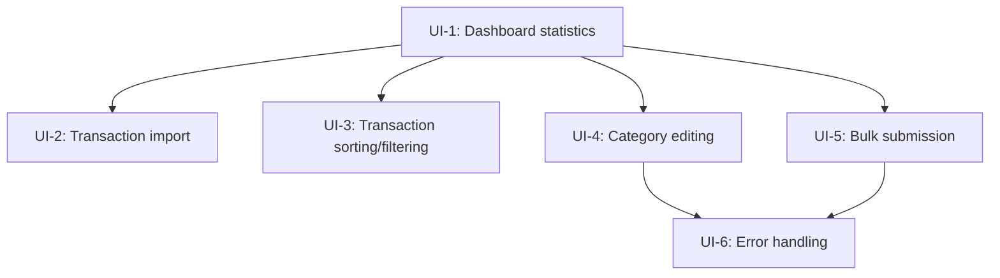
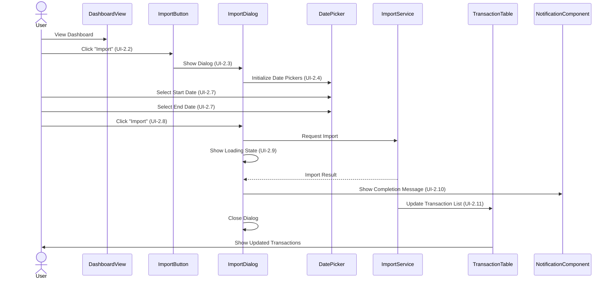
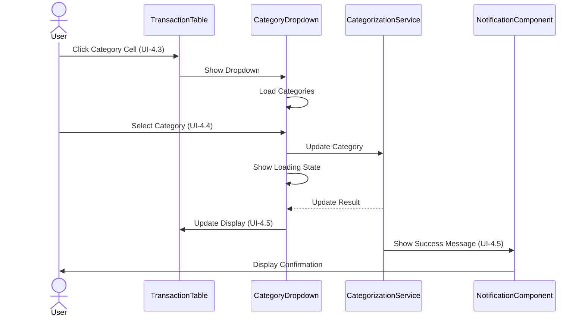
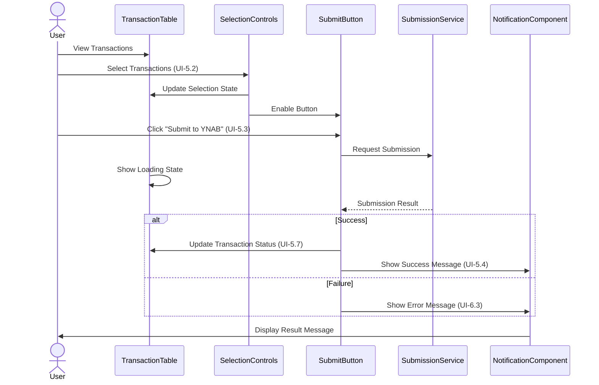
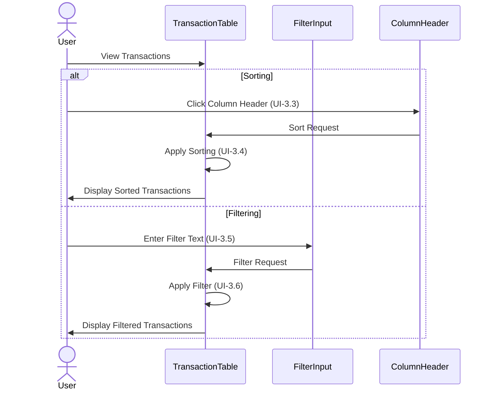

# Budget UI Scenario Map

> This document maps Gherkin scenarios to specific UI components and interactions, following a BDD-driven UI development approach. It serves as a bridge between domain-driven scenarios and user interface implementation.

## 1. Scenario Grouping and Analysis

The scenarios have been grouped by UI area or functionality to identify shared UI components and dependencies.

### 1.1. UI Scenario Groups

| Group | Scenarios | Priority | Dependencies |
|-------|-----------|----------|--------------|
| Dashboard View | UI-1: Dashboard statistics | High | None |
| Import Functionality | UI-2: Transaction import with date range | High | Dashboard View |
| Transaction Management | UI-3: Transaction sorting and filtering<br>UI-4: Transaction category editing<br>UI-5: Bulk selection and submission | Medium | Dashboard View |
| Error Handling | UI-6: Validation failures and error messages | Low | Transaction Management |

### 1.2. Shared UI Components Across Scenarios

| UI Component | Scenarios | Shared Responsibility |
|--------------|-----------|------------------------|
| TransactionTable | UI-1, UI-3, UI-4, UI-5, UI-6 | Displaying transaction data |
| ImportDialog | UI-2 | Configuring transaction imports |
| CategoryDropdown | UI-4 | Selecting transaction categories |
| DashboardView | UI-1, UI-2, UI-3, UI-4, UI-5, UI-6 | Main application dashboard |
| NotificationComponent | UI-2, UI-4, UI-5, UI-6 | User feedback and alerts |

### 1.3. Dependencies Between Scenarios



## 2. Component Identification

This section maps specific UI components to scenario steps, identifying the components needed to implement each scenario.

### 2.1. UI Component Inventory

| Component | Type | Purpose | Scenario Steps |
|-----------|------|---------|---------------|
| DashboardView | Container | Main dashboard page | UI-1.1, UI-2.1, UI-3.1, UI-4.1, UI-5.1, UI-6.1 |
| StatisticsPanel | Display | Show transaction statistics | UI-1.2 |
| ImportButton | Action Button | Trigger import workflow | UI-1.4, UI-2.2 |
| TransactionTable | Interactive Table | Display and interact with transactions | UI-1.5, UI-3.2-3.5, UI-4.2-4.5, UI-5.2-5.5, UI-6.2-6.4 |
| StatusIndicator | Visual Indicator | Display transaction status | UI-1.5, UI-5.5 |
| ImportDialog | Modal Dialog | Configure and initiate imports | UI-2.3-2.6 |
| DatePicker | Form Control | Select date ranges | UI-2.4, UI-2.7 |
| LoadingIndicator | Visual Indicator | Show processing status | UI-2.9 |
| NotificationComponent | Alert | Show success/error messages | UI-2.10, UI-4.5, UI-5.4, UI-6.3 |
| CategoryDropdown | Form Control | Select transaction categories | UI-4.3-4.4 |
| SelectionControls | Checkbox Group | Select multiple transactions | UI-5.2 |
| SubmitButton | Action Button | Submit transactions to YNAB | UI-5.3 |

### 2.2. Component Mapping to Scenarios

#### UI-1: Dashboard displays transaction summary statistics

| Scenario Step | Components | Responsibility |
|--------------|------------|----------------|
| User navigates to the dashboard | DashboardView | Display main application interface |
| Dashboard displays summary statistics | StatisticsPanel | Fetch and display transaction statistics |
| Dashboard contains Import button | ImportButton | Provide access to import functionality |
| Dashboard displays transaction table with status indicators | TransactionTable, StatusIndicator | Display transactions and their current status |

#### UI-2: User can initiate a new transaction import with date range

| Scenario Step | Components | Responsibility |
|--------------|------------|----------------|
| User is on dashboard screen | DashboardView | Display main application interface |
| User clicks Import button | ImportButton | Trigger import dialog |
| Import dialog appears | ImportDialog | Configure import parameters |
| Dialog contains date fields | DatePicker (2x) | Allow date range selection |
| Dialog contains Import button | ImportButton | Initiate import process |
| User selects date range | DatePicker (2x) | Capture date range parameters |
| User clicks import dialog Import button | ImportButton | Submit import request |
| System delegates to domain service | (Non-UI) | Backend processing |
| User sees loading indicator | LoadingIndicator | Indicate processing in progress |
| User notified when import complete | NotificationComponent | Show completion status |
| Transaction table updates | TransactionTable | Refresh with new transactions |

#### UI-3: Transaction list provides sorting and filtering

| Scenario Step | Components | Responsibility |
|--------------|------------|----------------|
| User is on dashboard screen | DashboardView | Display main application interface |
| Transaction table contains transactions | TransactionTable | Display transaction data |
| User clicks column header | TransactionTable | Trigger sorting action |
| Transactions are sorted | TransactionTable | Update display order |
| User enters filter text | TransactionTable | Capture filter criteria |
| Transactions are filtered | TransactionTable | Apply filter and update display |

#### UI-4: User can edit transaction category via dropdown

| Scenario Step | Components | Responsibility |
|--------------|------------|----------------|
| User is on dashboard screen | DashboardView | Display main application interface |
| Transaction table contains transactions | TransactionTable | Display transaction data |
| User clicks category cell | TransactionTable | Trigger category edit mode |
| Dropdown with categories appears | CategoryDropdown | Display category options |
| User selects different category | CategoryDropdown | Capture category selection |
| Transaction category updated | TransactionTable | Update displayed category |
| User sees confirmation message | NotificationComponent | Confirm successful update |

#### UI-5: Bulk selection and submission of transactions

| Scenario Step | Components | Responsibility |
|--------------|------------|----------------|
| User is on dashboard screen | DashboardView | Display main application interface |
| Transaction table contains categorized transactions | TransactionTable | Display transaction data |
| User selects multiple transactions | SelectionControls, TransactionTable | Enable multi-selection |
| User clicks Submit to YNAB button | SubmitButton | Trigger submission process |
| Transactions submitted to YNAB | (Non-UI) | Backend processing |
| User sees success message | NotificationComponent | Confirm successful submission |
| Transaction status indicators update | StatusIndicator, TransactionTable | Update transaction status |

#### UI-6: Error messages are displayed for validation failures

| Scenario Step | Components | Responsibility |
|--------------|------------|----------------|
| User is on dashboard screen | DashboardView | Display main application interface |
| Transaction table contains uncategorized transactions | TransactionTable | Display transaction data |
| User selects those transactions | SelectionControls, TransactionTable | Enable multi-selection |
| User clicks Submit to YNAB button | SubmitButton | Trigger submission process |
| User sees error message | NotificationComponent | Display validation error |
| Transactions remain unsubmitted | TransactionTable, StatusIndicator | Maintain current status |

## 3. UI State Mapping

This section defines the different states each component can be in, driven by scenario steps.

### 3.1. DashboardView States

| State ID | Description | Triggered By | UI Elements | Scenario Step |
|----------|-------------|--------------|-------------|---------------|
| DV-1 | Initial Load | Application start | Empty layout structure | Pre-UI-1.1 |
| DV-2 | Loading | After navigation | Layout + LoadingIndicator | During UI-1.1 |
| DV-3 | Loaded | Data retrieved | Complete dashboard | UI-1.1 complete |
| DV-4 | Error | Failed data load | Error message | Error case |

### 3.2. StatisticsPanel States

| State ID | Description | Triggered By | UI Elements | Scenario Step |
|----------|-------------|--------------|-------------|---------------|
| SP-1 | Loading | Dashboard load | Skeleton or spinner | During UI-1.2 |
| SP-2 | Loaded | Statistics retrieved | Statistics display | UI-1.2 complete |
| SP-3 | Updated | After import/categorize/submit | Updated statistics | After UI-2.11, UI-4.6, UI-5.7 |
| SP-4 | Error | Failed statistics load | Error indicator | Error case |

### 3.3. TransactionTable States

| State ID | Description | Triggered By | UI Elements | Scenario Step |
|----------|-------------|--------------|-------------|---------------|
| TT-1 | Initial Load | Dashboard load | Empty or loading table | During UI-1.5 |
| TT-2 | Loaded | Transactions retrieved | Populated table | UI-1.5 complete |
| TT-3 | Sorted | Column header click | Sorted table, sort indicator | UI-3.4 |
| TT-4 | Filtered | Filter input | Filtered table, filter indicator | UI-3.6 |
| TT-5 | Category Edit | Click category cell | Editable cell with dropdown | UI-4.3 |
| TT-6 | Selection Active | Check row checkbox | Checked rows, selection count | UI-5.2 |
| TT-7 | Submission Loading | Click Submit | Loading indicator on rows | During UI-5.5 |
| TT-8 | Submission Complete | Submission success | Updated status indicators | UI-5.7 |
| TT-9 | Submission Error | Submission failure | Error indicator on rows | UI-6.5 |

### 3.4. ImportDialog States

| State ID | Description | Triggered By | UI Elements | Scenario Step |
|----------|-------------|--------------|-------------|---------------|
| ID-1 | Hidden | Initial state | Not visible | Before UI-2.3 |
| ID-2 | Visible | Click Import button | Dialog with empty fields | UI-2.3 |
| ID-3 | Configured | Date selection | Dialog with selected dates | UI-2.7 |
| ID-4 | Submitting | Click dialog Import button | Dialog with spinner | During UI-2.8 |
| ID-5 | Success | Import complete | Success confirmation | UI-2.10 partial |
| ID-6 | Error | Import failure | Error message | Error case |

### 3.5. CategoryDropdown States

| State ID | Description | Triggered By | UI Elements | Scenario Step |
|----------|-------------|--------------|-------------|---------------|
| CD-1 | Closed | Initial state | Not visible | Before UI-4.3 |
| CD-2 | Opening | Click category cell | Loading categories | During UI-4.3 |
| CD-3 | Open | Categories loaded | Expanded dropdown | UI-4.3 complete |
| CD-4 | Selected | Category choice | Selected category highlighted | UI-4.4 |
| CD-5 | Submitting | Selection confirmed | Loading indicator | Between UI-4.4 and UI-4.5 |
| CD-6 | Success | Update complete | Updated cell value | UI-4.5 |
| CD-7 | Error | Update failure | Error indicator | Error case |

### 3.6. NotificationComponent States

| State ID | Description | Triggered By | UI Elements | Scenario Step |
|----------|-------------|--------------|-------------|---------------|
| NC-1 | Hidden | Initial state | Not visible | Default state |
| NC-2 | Success | Successful operation | Success message | UI-2.10, UI-4.5, UI-5.4 |
| NC-3 | Error | Failed operation | Error message | UI-6.3 |
| NC-4 | Info | Informational update | Info message | Various |
| NC-5 | Fading | After display time | Fading notification | After any notification |

## 4. Data Requirement Specification

This section defines the data required by each component to render its various states.

### 4.1. View Model Requirements

#### 4.1.1. DashboardViewModel

| Property | Type | Source | Purpose | Scenarios |
|----------|------|--------|---------|-----------|
| statisticsViewModel | StatisticsViewModel | Domain statistics | Display transaction statistics | UI-1 |
| transactionTableViewModel | TransactionTableViewModel | Domain transactions | Display transaction list | UI-1, UI-3, UI-4, UI-5, UI-6 |
| isLoading | Boolean | UI state | Show loading state | All |
| errorMessage | Option[String] | Domain errors | Display error messages | All error cases |

#### 4.1.2. StatisticsViewModel

| Property | Type | Source | Purpose | Scenarios |
|----------|------|--------|---------|-----------|
| totalCount | Int | Transaction repository query | Display total transaction count | UI-1 |
| categorizedCount | Int | Transaction processing state query | Display categorized count | UI-1 |
| submittedCount | Int | Transaction processing state query | Display submitted count | UI-1 |
| percentCategorized | Double | Calculated from counts | Display completion percentage | UI-1 |
| percentSubmitted | Double | Calculated from counts | Display submission percentage | UI-1 |

#### 4.1.3. TransactionTableViewModel

| Property | Type | Source | Purpose | Scenarios |
|----------|------|--------|---------|-----------|
| transactions | Seq[TransactionRowViewModel] | Transaction and processing state | Core table data | UI-1, UI-3, UI-4, UI-5, UI-6 |
| sortColumn | Option[String] | UI state | Current sort column | UI-3 |
| sortDirection | Option[SortDirection] | UI state | Current sort direction | UI-3 |
| filterText | Option[String] | UI state | Current filter text | UI-3 |
| selectedTransactionIds | Set[String] | UI state | Selected transaction IDs | UI-5, UI-6 |
| isSubmitting | Boolean | UI state | Whether submission in progress | UI-5 |
| canSubmit | Boolean | Derived from selection | Enable/disable submit button | UI-5, UI-6 |

#### 4.1.4. TransactionRowViewModel

| Property | Type | Source | Purpose | Scenarios |
|----------|------|--------|---------|-----------|
| id | String | Transaction.id | Unique identifier | All |
| date | LocalDate | Transaction.date | Transaction date | UI-1, UI-3 |
| description | String | Transaction.description | Transaction description | UI-1, UI-3 |
| amount | BigDecimal | Transaction.amount | Transaction amount | UI-1, UI-3 |
| formattedAmount | String | Formatted Transaction.amount | Formatted display | UI-1, UI-3 |
| categoryId | Option[String] | ProcessingState.categoryId | Current category ID | UI-4 |
| categoryName | Option[String] | Category lookup | Current category name | UI-4 |
| status | TransactionStatus | ProcessingState.status | Transaction status | UI-1, UI-5 |
| statusClass | String | Derived from status | CSS class for status | UI-1, UI-5 |
| isSelected | Boolean | UI state | Selection state | UI-5, UI-6 |
| isEditable | Boolean | Derived from status | Whether category can be edited | UI-4 |

#### 4.1.5. ImportDialogViewModel

| Property | Type | Source | Purpose | Scenarios |
|----------|------|--------|---------|-----------|
| startDate | Option[LocalDate] | UI state | Selected start date | UI-2 |
| endDate | Option[LocalDate] | UI state | Selected end date | UI-2 |
| isValid | Boolean | Derived from dates | Enable/disable import | UI-2 |
| isSubmitting | Boolean | UI state | Show submission state | UI-2 |
| errorMessage | Option[String] | Domain errors | Display validation errors | UI-2 error case |

#### 4.1.6. CategoryDropdownViewModel

| Property | Type | Source | Purpose | Scenarios |
|----------|------|--------|---------|-----------|
| transactionId | String | Transaction being edited | Target transaction | UI-4 |
| categories | Seq[CategoryViewModel] | Category repository | Available categories | UI-4 |
| selectedCategoryId | Option[String] | Current category | Pre-selected value | UI-4 |
| isLoading | Boolean | UI state | Loading state | UI-4 |

### 4.2. Data Transformations

#### 4.2.1. Domain to View Model Transformations

```scala
// Transform domain Transaction and TransactionProcessingState to TransactionRowViewModel
def toTransactionRowViewModel(
  transaction: Transaction,
  processingState: TransactionProcessingState,
  category: Option[Category],
  isSelected: Boolean
): TransactionRowViewModel =
  TransactionRowViewModel(
    id = transaction.id.value,
    date = transaction.date,
    description = transaction.description,
    amount = transaction.amount,
    formattedAmount = formatCurrency(transaction.amount),
    categoryId = processingState.categoryId,
    categoryName = category.map(_.name),
    status = processingState.status,
    statusClass = statusToCssClass(processingState.status),
    isSelected = isSelected,
    isEditable = processingState.status != TransactionStatus.Submitted
  )

// Statistics transformation
def toStatisticsViewModel(stats: SubmissionStatistics): StatisticsViewModel =
  StatisticsViewModel(
    totalCount = stats.totalCount,
    categorizedCount = stats.categorizedCount,
    submittedCount = stats.submittedCount,
    percentCategorized = calculatePercentage(stats.categorizedCount, stats.totalCount),
    percentSubmitted = calculatePercentage(stats.submittedCount, stats.totalCount)
  )
```

#### 4.2.2. View Model to Domain Transformations

```scala
// Transform import dialog inputs to domain service parameters
def toImportParameters(viewModel: ImportDialogViewModel): Option[ImportParameters] =
  for
    start <- viewModel.startDate
    end <- viewModel.endDate
    if start.isBefore(end) || start.isEqual(end)
  yield ImportParameters(start, end)

// Transform category selection to domain update request
def toCategoryUpdateRequest(
  transactionId: String, 
  categoryId: String
): TransactionCategorization =
  TransactionCategorization(
    transactionId = TransactionId(transactionId),
    categoryId = CategoryId(categoryId),
    source = CategorizationSource.Manual
  )
```

## 5. Interaction Flow Modeling

This section maps out the user interaction flows for key scenarios.

### 5.1. Transaction Import Flow



### 5.2. Transaction Category Update Flow



### 5.3. Bulk Submission Flow



### 5.4. Transaction Filtering and Sorting Flow



## 6. UI Component Specification

This section provides detailed specifications for each UI component.

### 6.1. DashboardView Component

#### 6.1.1. Purpose
Main container component that orchestrates all dashboard elements to support scenarios UI-1 through UI-6.

#### 6.1.2. Props/Inputs
- `statisticsViewModel: StatisticsViewModel` - Statistics data to display
- `transactionTableViewModel: TransactionTableViewModel` - Transaction data to display
- `onImportClicked: () => Unit` - Callback for import button click
- `onSubmitClicked: (Set[String]) => Unit` - Callback for submit button click
- `onCategoryEditRequested: (String) => Unit` - Callback for category edit
- `isLoading: Boolean` - Whether dashboard is loading
- `errorMessage: Option[String]` - Error message to display

#### 6.1.3. Behaviors
- Renders overall dashboard layout with statistics panel and transaction table
- Coordinates interactions between components
- Manages dashboard-level state
- Displays appropriate loading and error states
- Delegates specialized functionality to child components

#### 6.1.4. State Management
- Tracks loading state during data fetching
- Maintains error state for failed operations
- Coordinates child component states

#### 6.1.5. Events Emitted
- `importRequested` - When import workflow is initiated
- `submitRequested` - When submission is requested
- `refreshRequested` - When dashboard refresh is needed

### 6.2. TransactionTable Component

#### 6.2.1. Purpose
Interactive table component that displays transaction data with sorting, filtering, selection, and editing capabilities to support scenarios UI-1, UI-3, UI-4, UI-5, and UI-6.

#### 6.2.2. Props/Inputs
- `viewModel: TransactionTableViewModel` - View model with transaction data and state
- `onSort: (String) => Unit` - Callback when sort column changes
- `onFilter: (String) => Unit` - Callback when filter text changes
- `onCategoryEdit: (String) => Unit` - Callback when category edit is requested
- `onSelectionChange: (Set[String]) => Unit` - Callback when selection changes
- `onSubmit: (Set[String]) => Unit` - Callback when submit is requested

#### 6.2.3. Behaviors
- Renders transactions in tabular format with columns: Date, Description, Amount, Category, Status
- Provides column sorting by clicking headers
- Includes filter input for filtering transactions
- Supports row selection via checkboxes
- Allows category cell click to initiate editing
- Shows status indicators for each transaction
- Handles loading states during operations

#### 6.2.4. Accessibility Requirements
- Proper table semantics with headers
- Keyboard navigation for all interactive elements
- ARIA attributes for dynamic content and state changes
- Focus management for editing and selection

#### 6.2.5. State Management
- Tracks sort column and direction
- Maintains filter text
- Manages row selection state
- Tracks category edit state

### 6.3. CategoryDropdown Component

#### 6.3.1. Purpose
Dropdown component for selecting transaction categories to support scenario UI-4.

#### 6.3.2. Props/Inputs
- `viewModel: CategoryDropdownViewModel` - View model with categories and state
- `onCategorySelected: (String, String) => Unit` - Callback when category is selected (transactionId, categoryId)
- `onCancel: () => Unit` - Callback when selection is cancelled

#### 6.3.3. Behaviors
- Displays list of available categories
- Allows selection of a category
- Shows loading state while categories are being fetched
- Highlights currently selected category
- Provides cancel option to abort selection

#### 6.3.4. Accessibility Requirements
- Keyboard navigation through options
- ARIA attributes for dropdown role
- Focus management for dropdown open/close

#### 6.3.5. State Management
- Tracks open/closed state
- Maintains selected category
- Handles loading state

### 6.4. ImportDialog Component

#### 6.4.1. Purpose
Modal dialog component for configuring and initiating transaction imports to support scenario UI-2.

#### 6.4.2. Props/Inputs
- `viewModel: ImportDialogViewModel` - View model with dialog state
- `onDateRangeChange: (Option[LocalDate], Option[LocalDate]) => Unit` - Callback when dates change
- `onImport: (LocalDate, LocalDate) => Unit` - Callback when import is requested
- `onClose: () => Unit` - Callback when dialog is closed

#### 6.4.3. Behaviors
- Displays date range selection controls
- Validates date inputs
- Provides import action button
- Shows loading state during import
- Displays success or error messages
- Auto-closes on successful import

#### 6.4.4. Accessibility Requirements
- Modal focus trap when open
- Keyboard navigation within dialog
- ARIA attributes for dialog role
- Escape key to close

#### 6.4.5. State Management
- Tracks dialog open/closed state
- Maintains date selections
- Validates input state
- Handles loading during import

### 6.5. NotificationComponent

#### 6.5.1. Purpose
Alert component for displaying success, error, and informational messages to support scenarios UI-2, UI-4, UI-5, and UI-6.

#### 6.5.2. Props/Inputs
- `type: NotificationType` - Type of notification (success, error, info)
- `message: String` - Message to display
- `autoHideDuration: Option[Int]` - How long to show notification in ms
- `onClose: () => Unit` - Callback when notification is closed

#### 6.5.3. Behaviors
- Displays message with appropriate styling based on type
- Auto-hides after specified duration if provided
- Provides manual close option
- Animates in and out of view

#### 6.5.4. Accessibility Requirements
- ARIA live region for announcements
- Sufficient color contrast for message types
- Keyboard access to close button

#### 6.5.5. State Management
- Tracks visibility state
- Manages auto-hide timer

## 7. Implementation Notes

### 7.1. Component Hierarchy

The component hierarchy follows this structure:

```
DashboardView
├── StatisticsPanel
├── ImportButton
├── TransactionTable
│   ├── ColumnHeaders
│   ├── FilterInput
│   ├── SelectionControls
│   ├── TransactionRows
│   │   ├── StatusIndicator (per row)
│   │   └── CategoryCell (per row)
│   └── SubmitButton
├── ImportDialog (modal)
│   ├── DatePicker (start)
│   ├── DatePicker (end)
│   └── ImportButton
├── CategoryDropdown (context-specific)
│   └── CategoryOptions
└── NotificationComponent (context-specific)
```

### 7.2. Key Integration Points

1. **Domain to UI**: 
   - TransactionRepository and TransactionProcessingStateRepository queries feed the TransactionTableViewModel
   - SubmissionStatistics from SubmissionService feeds the StatisticsViewModel
   - CategoryRepository provides categories for CategoryDropdownViewModel

2. **UI to Domain**:
   - ImportDialog triggers ImportService.importTransactions
   - CategoryDropdown triggers CategorizationService.updateTransactionCategory
   - TransactionTable selection with Submit button triggers SubmissionService.submitTransactions

3. **Event Handling**:
   - DomainEvents trigger UI updates through event subscription
   - UI events trigger domain service calls through presenter layer

### 7.3. Performance Considerations

1. **Pagination**: 
   - TransactionTable should implement pagination for large datasets
   - Initial implementation should limit to 50-100 transactions per page

2. **Lazy Loading**:
   - CategoryDropdown should load categories only when opened
   - Statistics could be cached and refreshed on significant events

3. **Optimistic Updates**:
   - Category updates should show immediately in UI before confirmation
   - Rollback on error should restore previous state

### 7.4. Accessibility and Internationalization

1. **Accessibility**:
   - All components must have proper ARIA attributes
   - Keyboard navigation must be fully supported
   - Color cannot be the only indicator of status

2. **Internationalization**:
   - All user-facing strings should be externalized
   - Date formatting should respect locale
   - Currency formatting should respect locale

## 8. Future Enhancements

1. **Advanced Filtering**:
   - Add multi-column filtering
   - Support date range filters
   - Implement saved filter presets

2. **Bulk Operations**:
   - Support bulk category assignment
   - Implement batch submission with progress tracking

3. **Table Customization**:
   - Allow column reordering
   - Support column visibility toggles
   - Implement saved view configurations

4. **Responsive Design**:
   - Adapt for mobile devices
   - Create condensed view for small screens

## 9. Traceability Matrix

| UI Component | Domain Component | Scenarios | Events |
|--------------|------------------|-----------|--------|
| DashboardView | - | UI-1, UI-2, UI-3, UI-4, UI-5, UI-6 | - |
| StatisticsPanel | SubmissionService | UI-1 | TransactionsSubmitted, TransactionsCategorized |
| ImportButton | - | UI-2 | - |
| TransactionTable | TransactionRepository | UI-1, UI-3, UI-4, UI-5, UI-6 | TransactionImported, ImportCompleted |
| StatusIndicator | TransactionProcessingState | UI-1, UI-5 | TransactionSubmitted, TransactionCategorized |
| ImportDialog | ImportService | UI-2 | ImportCompleted |
| CategoryDropdown | CategoryRepository, CategorizationService | UI-4 | CategoryUpdated |
| NotificationComponent | - | UI-2, UI-4, UI-5, UI-6 | Various |
| SubmitButton | SubmissionService | UI-5, UI-6 | TransactionsSubmitted, SubmissionFailed |