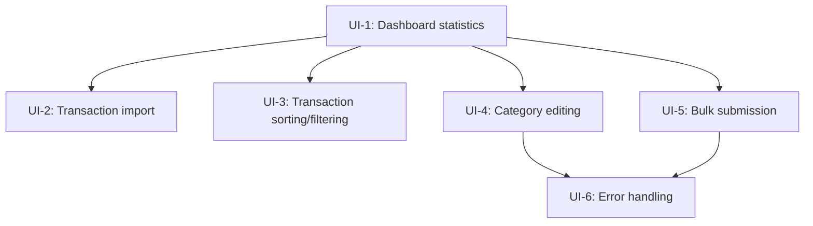
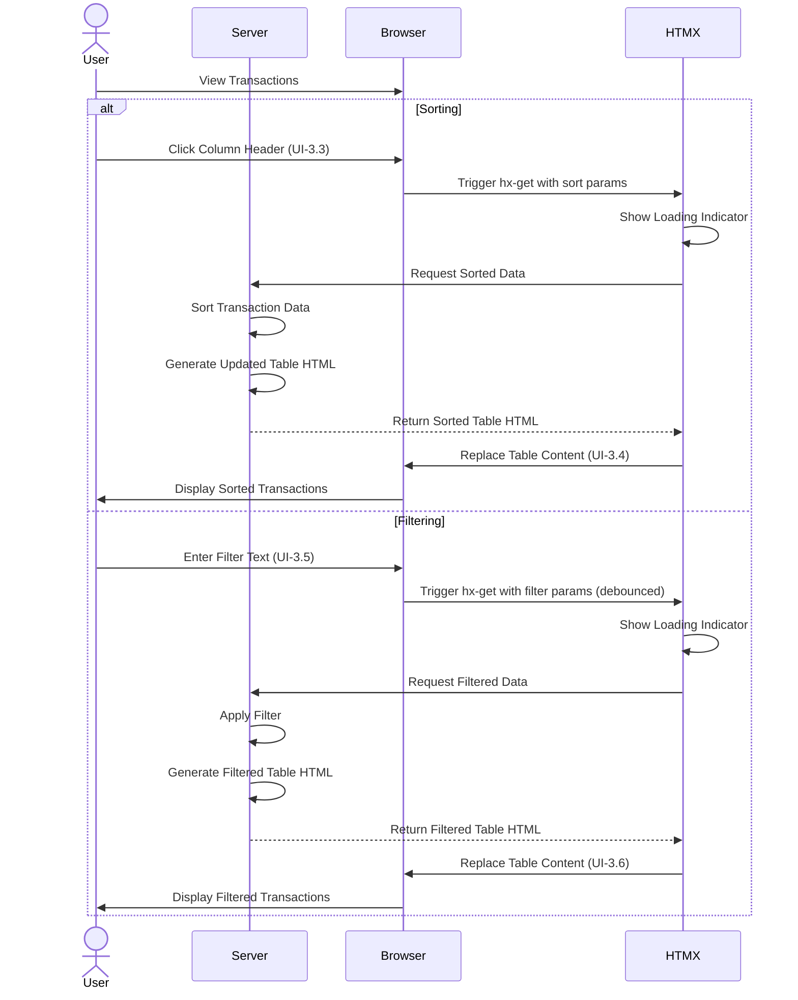

# Budget UI Scenario Map

> This document maps Gherkin scenarios to specific UI components and interactions, following a BDD-driven UI development approach. It serves as a bridge between domain-driven scenarios and user interface implementation.

## 1. Scenario Grouping and Analysis

The scenarios have been grouped by UI area or functionality to identify shared UI components and dependencies.

### 1.1. UI Scenario Groups

| Group | Scenarios | Priority | Dependencies |
|-------|-----------|----------|--------------|
| Dashboard View | UI-1: Dashboard statistics | High | None |
| Import Functionality | UI-2: Transaction import with date range | High | Dashboard View |
| Transaction Management | UI-3: Transaction sorting and filtering<br>UI-4: Transaction category editing<br>UI-5: Bulk selection and submission | Medium | Dashboard View |
| Error Handling | UI-6: Validation failures and error messages | Low | Transaction Management |

### 1.2. Shared UI Components Across Scenarios

| UI Component | Scenarios | Shared Responsibility |
|--------------|-----------|------------------------|
| TransactionTable | UI-1, UI-3, UI-4, UI-5, UI-6 | Displaying transaction data |
| ImportDialog | UI-2 | Configuring transaction imports |
| CategoryDropdown | UI-4 | Selecting transaction categories |
| DashboardView | UI-1, UI-2, UI-3, UI-4, UI-5, UI-6 | Main application dashboard |
| NotificationComponent | UI-2, UI-4, UI-5, UI-6 | User feedback and alerts |

### 1.3. Dependencies Between Scenarios



## 2. Component Identification

This section maps specific UI components to scenario steps, identifying the components needed to implement each scenario.

### 2.1. UI Component Inventory

| Component | Type | Purpose | Scenario Steps |
|-----------|------|---------|---------------|
| DashboardView | Container | Main dashboard page | UI-1.1, UI-2.1, UI-3.1, UI-4.1, UI-5.1, UI-6.1 |
| StatisticsPanel | Display | Show transaction statistics | UI-1.2 |
| ImportButton | Action Button | Trigger import workflow | UI-1.4, UI-2.2 |
| TransactionTable | Interactive Table | Display and interact with transactions | UI-1.5, UI-3.2-3.5, UI-4.2-4.5, UI-5.2-5.5, UI-6.2-6.4 |
| StatusIndicator | Visual Indicator | Display transaction status | UI-1.5, UI-5.5 |
| ImportDialog | Modal Dialog | Configure and initiate imports | UI-2.3-2.6 |
| DatePicker | Form Control | Select date ranges | UI-2.4, UI-2.7 |
| LoadingIndicator | Visual Indicator | Show processing status | UI-2.9 |
| NotificationComponent | Alert | Show success/error messages | UI-2.10, UI-4.5, UI-5.4, UI-6.3 |
| CategoryDropdown | Form Control | Select transaction categories | UI-4.3-4.4 |
| SelectionControls | Checkbox Group | Select multiple transactions | UI-5.2 |
| SubmitButton | Action Button | Submit transactions to YNAB | UI-5.3 |

### 2.2. Component Mapping to Scenarios

#### UI-1: Dashboard displays transaction summary statistics

| Scenario Step | Components | Responsibility |
|--------------|------------|----------------|
| User navigates to the dashboard | DashboardView | Display main application interface |
| Dashboard displays summary statistics | StatisticsPanel | Fetch and display transaction statistics |
| Dashboard contains Import button | ImportButton | Provide access to import functionality |
| Dashboard displays transaction table with status indicators | TransactionTable, StatusIndicator | Display transactions and their current status |

#### UI-2: User can initiate a new transaction import with date range

| Scenario Step | Components | Responsibility |
|--------------|------------|----------------|
| User is on dashboard screen | DashboardView | Display main application interface |
| User clicks Import button | ImportButton | Trigger import dialog |
| Import dialog appears | ImportDialog | Configure import parameters |
| Dialog contains date fields | DatePicker (2x) | Allow date range selection |
| Dialog contains Import button | ImportButton | Initiate import process |
| User selects date range | DatePicker (2x) | Capture date range parameters |
| User clicks import dialog Import button | ImportButton | Submit import request |
| System delegates to domain service | (Non-UI) | Backend processing |
| User sees loading indicator | LoadingIndicator | Indicate processing in progress |
| User notified when import complete | NotificationComponent | Show completion status |
| Transaction table updates | TransactionTable | Refresh with new transactions |

#### UI-3: Transaction list provides sorting and filtering

| Scenario Step | Components | Responsibility |
|--------------|------------|----------------|
| User is on dashboard screen | DashboardView | Display main application interface |
| Transaction table contains transactions | TransactionTable | Display transaction data |
| User clicks column header | TransactionTable | Trigger sorting action |
| Transactions are sorted | TransactionTable | Update display order |
| User enters filter text | TransactionTable | Capture filter criteria |
| Transactions are filtered | TransactionTable | Apply filter and update display |

#### UI-4: User can edit transaction category via dropdown

| Scenario Step | Components | Responsibility |
|--------------|------------|----------------|
| User is on dashboard screen | DashboardView | Display main application interface |
| Transaction table contains transactions | TransactionTable | Display transaction data |
| User clicks category cell | TransactionTable | Trigger category edit mode |
| Dropdown with categories appears | CategoryDropdown | Display category options |
| User selects different category | CategoryDropdown | Capture category selection |
| Transaction category updated | TransactionTable | Update displayed category |
| User sees confirmation message | NotificationComponent | Confirm successful update |

#### UI-5: Bulk selection and submission of transactions

| Scenario Step | Components | Responsibility |
|--------------|------------|----------------|
| User is on dashboard screen | DashboardView | Display main application interface |
| Transaction table contains categorized transactions | TransactionTable | Display transaction data |
| User selects multiple transactions | SelectionControls, TransactionTable | Enable multi-selection |
| User clicks Submit to YNAB button | SubmitButton | Trigger submission process |
| Transactions submitted to YNAB | (Non-UI) | Backend processing |
| User sees success message | NotificationComponent | Confirm successful submission |
| Transaction status indicators update | StatusIndicator, TransactionTable | Update transaction status |

#### UI-6: Error messages are displayed for validation failures

| Scenario Step | Components | Responsibility |
|--------------|------------|----------------|
| User is on dashboard screen | DashboardView | Display main application interface |
| Transaction table contains uncategorized transactions | TransactionTable | Display transaction data |
| User selects those transactions | SelectionControls, TransactionTable | Enable multi-selection |
| User clicks Submit to YNAB button | SubmitButton | Trigger submission process |
| User sees error message | NotificationComponent | Display validation error |
| Transactions remain unsubmitted | TransactionTable, StatusIndicator | Maintain current status |

## 3. UI State Mapping

This section defines the different states each component can be in, driven by scenario steps.

### 3.1. DashboardView States

| State ID | Description | Triggered By | UI Elements | Scenario Step |
|----------|-------------|--------------|-------------|---------------|
| DV-1 | Initial Render | Application start | Complete dashboard with initial data | UI-1.1 |
| DV-2 | Error | Failed data load | Error message | Error case |

> **Note**: With our Scalatags (server-rendered) and HTMX architecture, the "Loading" state is typically handled by HTMX's built-in indicators during requests rather than explicitly rendered states. The initial page load includes complete data.

### 3.2. StatisticsPanel States

| State ID | Description | Triggered By | UI Elements | Scenario Step |
|----------|-------------|--------------|-------------|---------------|
| SP-1 | Initial Render | Dashboard render | Statistics display | UI-1.2 |
| SP-2 | Updated | HTMX trigger after import/categorize/submit | Refreshed statistics | After UI-2.11, UI-4.6, UI-5.7 |
| SP-3 | Error | Failed statistics load | Error indicator | Error case |

> **Note**: With Scalatags and HTMX, the statistics panel would typically be server-rendered with initial data and then partially updated via HTMX requests after operations that change statistics (like imports or submissions).

### 3.3. TransactionTable States

| State ID | Description | Triggered By | UI Elements | Scenario Step |
|----------|-------------|--------------|-------------|---------------|
| TT-1 | Initial Render | Dashboard render | Populated table | UI-1.5 |
| TT-2 | Sorted | HTMX request after column header click | Refreshed table with sort indicator | UI-3.4 |
| TT-3 | Filtered | HTMX request after filter input | Refreshed table with filter results | UI-3.6 |
| TT-4 | Category Edit Mode | HTMX request after cell click | Rendered dropdown in place of cell | UI-4.3 |
| TT-5 | Selection Active | Client-side checkbox toggle (HTMX boost) | Checked rows, selection count | UI-5.2 |
| TT-6 | Submission Complete | HTMX response after submission | Refreshed table with updated status | UI-5.7 |
| TT-7 | Submission Error | HTMX response after failed submission | Error message | UI-6.5 |

> **Note**: With Scalatags and HTMX, operations like sorting, filtering, and category editing would trigger HTMX requests to the server, which would return updated HTML fragments that replace portions of the page. Loading indicators during these operations would be handled automatically by HTMX.

### 3.4. ImportDialog States

| State ID | Description | Triggered By | UI Elements | Scenario Step |
|----------|-------------|--------------|-------------|---------------|
| ID-1 | Hidden | Initial state | Not present in DOM | Before UI-2.3 |
| ID-2 | Visible | HTMX request after Import button click | Dialog with empty fields | UI-2.3 |
| ID-3 | Configured | Client-side date selections | Dialog with selected dates | UI-2.7 |
| ID-4 | Success Response | HTMX response after import completes | Success notification | UI-2.10 |
| ID-5 | Error Response | HTMX response after import failure | Error message | Error case |

> **Note**: With Scalatags+HTMX, the import dialog would be a server-rendered component that appears after an HTMX request. The form submission would use HTMX to process the request and show results without full page reloads. HTMX's built-in indicators would show loading state during the import operation.

### 3.5. CategoryDropdown States

| State ID | Description | Triggered By | UI Elements | Scenario Step |
|----------|-------------|--------------|-------------|---------------|
| CD-1 | Not Rendered | Initial state | Not present in DOM | Before UI-4.3 |
| CD-2 | Rendered | HTMX request after category cell click | Server-rendered dropdown | UI-4.3 |
| CD-3 | Success Response | HTMX response after selection | Updated cell with new category | UI-4.5 |
| CD-4 | Error Response | HTMX response after failure | Error message | Error case |

> **Note**: With Scalatags+HTMX, the category dropdown would typically be loaded via an HTMX request that replaces the cell content with a server-rendered dropdown. After selection, another HTMX request would submit the change and receive the updated cell content.

### 3.6. NotificationComponent States

| State ID | Description | Triggered By | UI Elements | Scenario Step |
|----------|-------------|--------------|-------------|---------------|
| NC-1 | Not Present | Initial state or no notification | Not in DOM or empty placeholder | Default state |
| NC-2 | Success | HTMX response including notification | Success message | UI-2.10, UI-4.5, UI-5.4 |
| NC-3 | Error | HTMX response including notification | Error message | UI-6.3 |
| NC-4 | Info | HTMX response including notification | Info message | Various |

> **Note**: With Scalatags+HTMX, notifications would typically be included in the server response HTML after operations and could use HTMX's `hx-swap-oob` for out-of-band updates to insert notifications into a designated area of the page. Client-side JS could handle auto-dismissal.

## 4. Data Requirement Specification

This section defines the data required by each component to render its various states.

### 4.1. View Model Requirements

#### 4.1.1. DashboardViewModel

| Property | Type | Source | Purpose | Scenarios |
|----------|------|--------|---------|-----------|
| statisticsViewModel | StatisticsViewModel | Domain statistics | Display transaction statistics | UI-1 |
| transactionTableViewModel | TransactionTableViewModel | Domain transactions | Display transaction list | UI-1, UI-3, UI-4, UI-5, UI-6 |
| isLoading | Boolean | UI state | Show loading state | All |
| errorMessage | Option[String] | Domain errors | Display error messages | All error cases |

#### 4.1.2. StatisticsViewModel

| Property | Type | Source | Purpose | Scenarios |
|----------|------|--------|---------|-----------|
| totalCount | Int | Transaction repository query | Display total transaction count | UI-1 |
| categorizedCount | Int | Transaction processing state query | Display categorized count | UI-1 |
| submittedCount | Int | Transaction processing state query | Display submitted count | UI-1 |
| percentCategorized | Double | Calculated from counts | Display completion percentage | UI-1 |
| percentSubmitted | Double | Calculated from counts | Display submission percentage | UI-1 |

#### 4.1.3. TransactionTableViewModel

| Property | Type | Source | Purpose | Scenarios |
|----------|------|--------|---------|-----------|
| transactions | Seq[TransactionRowViewModel] | Transaction and processing state | Core table data | UI-1, UI-3, UI-4, UI-5, UI-6 |
| sortColumn | Option[String] | UI state | Current sort column | UI-3 |
| sortDirection | Option[SortDirection] | UI state | Current sort direction | UI-3 |
| filterText | Option[String] | UI state | Current filter text | UI-3 |
| selectedTransactionIds | Set[String] | UI state | Selected transaction IDs | UI-5, UI-6 |
| isSubmitting | Boolean | UI state | Whether submission in progress | UI-5 |
| canSubmit | Boolean | Derived from selection | Enable/disable submit button | UI-5, UI-6 |

#### 4.1.4. TransactionRowViewModel

| Property | Type | Source | Purpose | Scenarios |
|----------|------|--------|---------|-----------|
| id | String | Transaction.id | Unique identifier | All |
| date | LocalDate | Transaction.date | Transaction date | UI-1, UI-3 |
| description | String | Transaction.description | Transaction description | UI-1, UI-3 |
| amount | BigDecimal | Transaction.amount | Transaction amount | UI-1, UI-3 |
| formattedAmount | String | Formatted Transaction.amount | Formatted display | UI-1, UI-3 |
| categoryId | Option[String] | ProcessingState.categoryId | Current category ID | UI-4 |
| categoryName | Option[String] | Category lookup | Current category name | UI-4 |
| status | TransactionStatus | ProcessingState.status | Transaction status | UI-1, UI-5 |
| statusClass | String | Derived from status | CSS class for status | UI-1, UI-5 |
| isSelected | Boolean | UI state | Selection state | UI-5, UI-6 |
| isEditable | Boolean | Derived from status | Whether category can be edited | UI-4 |

#### 4.1.5. ImportDialogViewModel

| Property | Type | Source | Purpose | Scenarios |
|----------|------|--------|---------|-----------|
| startDate | Option[LocalDate] | UI state | Selected start date | UI-2 |
| endDate | Option[LocalDate] | UI state | Selected end date | UI-2 |
| isValid | Boolean | Derived from dates | Enable/disable import | UI-2 |
| isSubmitting | Boolean | UI state | Show submission state | UI-2 |
| errorMessage | Option[String] | Domain errors | Display validation errors | UI-2 error case |

#### 4.1.6. CategoryDropdownViewModel

| Property | Type | Source | Purpose | Scenarios |
|----------|------|--------|---------|-----------|
| transactionId | String | Transaction being edited | Target transaction | UI-4 |
| categories | Seq[CategoryViewModel] | Category repository | Available categories | UI-4 |
| selectedCategoryId | Option[String] | Current category | Pre-selected value | UI-4 |
| isLoading | Boolean | UI state | Loading state | UI-4 |

### 4.2. Data Transformations

#### 4.2.1. Domain to View Model Transformations

```scala
// Transform domain Transaction and TransactionProcessingState to TransactionRowViewModel
def toTransactionRowViewModel(
  transaction: Transaction,
  processingState: TransactionProcessingState,
  category: Option[Category],
  isSelected: Boolean
): TransactionRowViewModel =
  TransactionRowViewModel(
    id = transaction.id.value,
    date = transaction.date,
    description = transaction.description,
    amount = transaction.amount,
    formattedAmount = formatCurrency(transaction.amount),
    categoryId = processingState.categoryId,
    categoryName = category.map(_.name),
    status = processingState.status,
    statusClass = statusToCssClass(processingState.status),
    isSelected = isSelected,
    isEditable = processingState.status != TransactionStatus.Submitted
  )

// Statistics transformation
def toStatisticsViewModel(stats: SubmissionStatistics): StatisticsViewModel =
  StatisticsViewModel(
    totalCount = stats.totalCount,
    categorizedCount = stats.categorizedCount,
    submittedCount = stats.submittedCount,
    percentCategorized = calculatePercentage(stats.categorizedCount, stats.totalCount),
    percentSubmitted = calculatePercentage(stats.submittedCount, stats.totalCount)
  )
```

#### 4.2.2. View Model to Domain Transformations

```scala
// Transform import dialog inputs to domain service parameters
def toImportParameters(viewModel: ImportDialogViewModel): Option[ImportParameters] =
  for
    start <- viewModel.startDate
    end <- viewModel.endDate
    if start.isBefore(end) || start.isEqual(end)
  yield ImportParameters(start, end)

// Transform category selection to domain update request
def toCategoryUpdateRequest(
  transactionId: String, 
  categoryId: String
): TransactionCategorization =
  TransactionCategorization(
    transactionId = TransactionId(transactionId),
    categoryId = CategoryId(categoryId),
    source = CategorizationSource.Manual
  )
```

## 5. Interaction Flow Modeling

This section maps out the user interaction flows for key scenarios.

### 5.1. Transaction Import Flow

```mermaid
sequenceDiagram
    Actor User
    participant Server
    participant Browser
    participant HTMX

    User->>Browser: View Dashboard
    User->>Browser: Click "Import" Button (UI-2.2)
    Browser->>HTMX: Trigger hx-get request
    HTMX->>Server: Request Import Dialog HTML
    
    Server->>Server: Generate Import Dialog HTML
    Server-->>HTMX: Return Dialog HTML
    HTMX->>Browser: Insert Dialog into DOM (UI-2.3, UI-2.4)
    
    User->>Browser: Select Start Date (UI-2.7)
    User->>Browser: Select End Date (UI-2.7)
    User->>Browser: Click Dialog "Import" Button (UI-2.8)
    Browser->>HTMX: Trigger hx-post with form data
    HTMX->>HTMX: Show Loading Indicator (UI-2.9)
    HTMX->>Server: Post Import Request

    Server->>Server: Process Import via ImportService
    Server->>Server: Generate Response HTML
    Server-->>HTMX: Return HTML with:
        - Success notification 
        - Updated transaction table
        - Updated statistics

    HTMX->>Browser: Update UI with server response (UI-2.10, UI-2.11)
    HTMX->>Browser: Close Import Dialog
    Browser->>User: Display Updated Dashboard
```

> **Note**: This flow demonstrates how with Scalatags+HTMX, the server handles HTML generation for each step, with HTMX managing the DOM updates and request indicators.

### 5.2. Transaction Category Update Flow

```mermaid
sequenceDiagram
    Actor User
    participant Server
    participant Browser
    participant HTMX

    User->>Browser: Click Category Cell (UI-4.3)
    Browser->>HTMX: Trigger hx-get request
    HTMX->>Server: Request Category Dropdown HTML
    
    Server->>Server: Fetch Categories from Repository
    Server->>Server: Generate Dropdown HTML
    Server-->>HTMX: Return Dropdown HTML
    HTMX->>Browser: Replace Cell with Dropdown (UI-4.3)
    
    User->>Browser: Select Category (UI-4.4)
    Browser->>HTMX: Trigger hx-post with selection
    HTMX->>HTMX: Show Loading Indicator
    HTMX->>Server: Post Category Update
    
    Server->>Server: Process via CategorizationService
    Server->>Server: Generate Response HTML
    Server-->>HTMX: Return HTML with:
        - Updated cell content
        - OOB notification element
        
    HTMX->>Browser: Update Cell Display (UI-4.5)
    HTMX->>Browser: Insert Notification (UI-4.5)
    Browser->>User: Display Updated Cell & Confirmation
```

> **Note**: With Scalatags+HTMX, the category editing involves two server interactions: one to load the dropdown and another to process the selection. HTMX's out-of-band swaps can update both the cell content and show a notification in a separate part of the page.

### 5.3. Bulk Submission Flow

```mermaid
sequenceDiagram
    Actor User
    participant Server
    participant Browser
    participant HTMX
    participant JSUtils

    User->>Browser: View Transactions
    User->>Browser: Check Transaction Checkboxes (UI-5.2)
    Browser->>JSUtils: Track Selected IDs (client-side)
    JSUtils->>Browser: Update Submit Button State
    
    User->>Browser: Click "Submit to YNAB" (UI-5.3)
    Browser->>HTMX: Trigger hx-post with selected IDs
    HTMX->>HTMX: Show Loading Indicator
    HTMX->>Server: Post Submission Request
    
    Server->>Server: Process via SubmissionService
    
    alt Success
        Server->>Server: Generate Success Response HTML
        Server-->>HTMX: Return HTML with:
            - Updated transaction rows
            - Updated statistics
            - Success notification
        HTMX->>Browser: Update UI Components (UI-5.4, UI-5.7)
    else Validation Failure
        Server->>Server: Generate Error Response HTML
        Server-->>HTMX: Return HTML with error notification
        HTMX->>Browser: Display Error Message (UI-6.3)
        Browser->>Browser: Keep Selections Intact
    end
    
    Browser->>User: Display Updated State
```

> **Note**: With Scalatags+HTMX, the bulk submission process uses client-side JS to track selected items, but the submission processing and UI updates are handled by the server. After submission, the server returns HTML fragments that HTMX uses to update multiple parts of the page simultaneously.

### 5.4. Transaction Filtering and Sorting Flow



> **Note**: With Scalatags+HTMX, both sorting and filtering operations trigger HTMX requests to the server, which responds with pre-rendered HTML fragments. The filtering requests could be debounced on the client side to prevent excessive requests during typing.

## 6. UI Component Specification

This section provides detailed specifications for each UI component.

### 6.1. DashboardView Component

#### 6.1.1. Purpose
Main container component that orchestrates all dashboard elements, rendered using Scalatags on the server side and enhanced with HTMX attributes.

#### 6.1.2. Server-side Data Requirements
- `statisticsViewModel: StatisticsViewModel` - Statistics data to display
- `transactionTableViewModel: TransactionTableViewModel` - Transaction data to display
- `errorMessage: Option[String]` - Error message to display

#### 6.1.3. HTMX Attributes and Endpoints
- `hx-get="/transactions/import-dialog"` - On Import button to fetch dialog
- `hx-get="/transactions?sort={column}"` - On column headers for sorting
- `hx-get="/transactions?filter={text}"` - On filter input for filtering
- `hx-post="/transactions/submit"` - On Submit button for batch submission
- `hx-target="#transaction-table"` - Target element for transaction updates
- `hx-swap="innerHTML"` - Replacement strategy for content updates

#### 6.1.4. Scalatags Rendering
- Renders overall dashboard layout with all child components
- Generates server-side HTML with appropriate HTMX attributes
- Embeds initial data in the rendered HTML
- Adds data-* attributes for client-side enhancements
- Includes CSS classes for visual state representation

#### 6.1.5. Server Endpoints
- `GET /transactions` - Main dashboard view
- `GET /transactions/import-dialog` - Import dialog HTML fragment
- `POST /transactions/import` - Process import request
- `GET /transactions/category-edit/{id}` - Category edit form HTML
- `POST /transactions/category-update` - Process category update
- `POST /transactions/submit` - Process submission request

#### 6.1.6. Response Types
- Full page HTML for initial load
- HTML fragments for HTMX updates
- OOB HTML fragments for notifications

### 6.2. TransactionTable Component

#### 6.2.1. Purpose
Server-rendered table component that displays transaction data with sorting, filtering, selection, and editing capabilities, enhanced with HTMX attributes for interactive behavior.

#### 6.2.2. Server-side Data Requirements
- `viewModel: TransactionTableViewModel` - View model with transaction data and state
- `currentSort: Option[(String, SortDirection)]` - Current sort column and direction
- `filterText: Option[String]` - Current filter text
- `selectedIds: Set[String]` - Currently selected transaction IDs

#### 6.2.3. HTMX Attributes
- `hx-get="/transactions?sort={column}"` - On column headers for sorting
- `hx-get="/transactions?filter={value}"` - For filter input
- `hx-trigger="keyup changed delay:500ms"` - For debounced filtering
- `hx-get="/transactions/category-edit/{id}"` - On category cells
- `hx-target="closest tr"` - For replacing targeted rows
- `hx-select="#row-{id}"` - For selecting specific rows to update

#### 6.2.4. Minimal Client-side JavaScript
- Checkbox selection state tracking
- Form submission with selected IDs
- UpdateSelectedCount() function
- EnableSubmitButton() function

#### 6.2.5. Scalatags Rendering Features
- Renders semantic HTML table with appropriate attributes
- Generates proper headers with sort indicators
- Includes filter input field with HTMX attributes
- Renders each transaction row with appropriate status and interactive elements
- Adds data-* attributes for state tracking
- Includes CSS classes for visual state representation

#### 6.2.6. Accessibility Requirements
- Proper table semantics with headers and scope attributes
- Keyboard navigation through tab index attributes
- ARIA attributes for dynamic content
- ARIA live regions for status updates
- Appropriate button and input labeling

### 6.3. CategoryDropdown Component

#### 6.3.1. Purpose
Server-rendered select element for choosing transaction categories, delivered via HTMX response when a category cell is clicked.

#### 6.3.2. Server-side Data Requirements
- `categories: Seq[CategoryViewModel]` - Available categories to select from
- `transactionId: String` - ID of the transaction being edited
- `currentCategoryId: Option[String]` - Currently assigned category ID

#### 6.3.3. HTMX Attributes
- `hx-post="/transactions/category-update"` - Form action for category update
- `hx-target="closest td"` - Target element for the update response
- `hx-include="this"` - Include the form data in the request
- `hx-swap="outerHTML"` - Replace the entire cell with the response

#### 6.3.4. Scalatags Rendering Features
- Renders a select element with options for each category
- Adds form wrapper with hidden transaction ID field
- Includes submit and cancel buttons
- Sets the currently selected category as default
- Auto-focuses the select element when rendered

#### 6.3.5. Server Response Handling
- Success: Returns the updated cell content with the new category
- Error: Returns the dropdown with an error message
- Cancel: Returns the original cell content without changes

#### 6.3.6. Accessibility Features
- Proper label association with the select element
- Keyboard navigation support
- ARIA attributes for roles and states
- Focus handling for the dropdown

### 6.4. ImportDialog Component

#### 6.4.1. Purpose
Server-rendered modal dialog component for configuring and initiating transaction imports, loaded on demand via HTMX request.

#### 6.4.2. Server-side Data Requirements
- `defaultStartDate: Option[LocalDate]` - Default start date (typically current month start)
- `defaultEndDate: Option[LocalDate]` - Default end date (typically current date)
- `errorMessage: Option[String]` - Any error message to display

#### 6.4.3. HTMX Attributes
- `hx-post="/transactions/import"` - Form action for import request
- `hx-target="#import-result"` - Target element for import results
- `hx-include="form"` - Include all form data in request
- `hx-indicator="#import-indicator"` - Element to show during request processing
- `hx-swap-oob="true"` - For out-of-band updates like notifications

#### 6.4.4. Scalatags Rendering Features
- Renders a modal dialog with semantic HTML5 structure
- Includes date input fields with appropriate constraints
- Provides form validation attributes
- Adds submit and cancel buttons
- Includes a loading indicator element

#### 6.4.5. Server Response Handling
- Success: Returns HTML fragments for:
  - Updated transaction table 
  - Success notification (out-of-band)
  - Updated statistics panel (out-of-band)
  - Close dialog directive
- Error: Returns error message within dialog

#### 6.4.6. Accessibility Features
- ARIA role="dialog" 
- ARIA labelledby and describedby attributes
- Focus trap within the modal
- Keyboard navigation support
- Escape key handler for closing

### 6.5. NotificationComponent

#### 6.5.1. Purpose
Server-rendered notification component that appears as part of HTMX responses to provide user feedback for operations.

#### 6.5.2. Server-side Data Requirements
- `notificationType: NotificationType` - Type of notification (success, error, info)
- `message: String` - Message to display
- `id: String` - Unique identifier for the notification

#### 6.5.3. Implementation Approaches

##### Option 1: HTMX Out-of-Band Swaps
- Rendered with `hx-swap-oob="true"` in server responses
- Targets a specific notification container in the DOM
- Includes minimal client-side JS for auto-dismissal

```html
<div id="notifications" hx-swap-oob="true">
  <div class="notification notification--success" 
       id="notification-123"
       role="alert">
    Transaction category updated successfully
    <button onclick="dismissNotification('notification-123')">×</button>
  </div>
</div>
```

##### Option 2: HTMX Response Headers
- Uses HTMX custom response headers
- Sets `HX-Trigger` header to trigger client-side events
- Minimal client-side JS handles notification display

```
HX-Trigger: {"showNotification": {"type": "success", "message": "Category updated successfully"}}
```

#### 6.5.4. Scalatags Rendering Features
- Renders alert component with appropriate CSS classes
- Includes dismiss button
- Adds appropriate ARIA attributes
- Assigns unique ID for reference and removal

#### 6.5.5. Minimal Client-side JavaScript
- Auto-dismissal after timeout
- Manual dismiss button handler
- Animation support (optional)

#### 6.5.6. Accessibility Features
- ARIA role="alert" or role="status"
- ARIA live regions for screen readers
- Sufficient color contrast
- Keyboard access to dismiss button

## 7. Implementation Notes

### 7.1. Server-side Component Structure

The server-side Scalatags component structure follows this organization:

```
DashboardView (server-rendered page)
├── StatisticsPanel (server-rendered fragment)
├── ImportButton (HTML with HTMX attributes)
├── TransactionTable (server-rendered fragment)
│   ├── ColumnHeaders (HTML with HTMX sort attributes)
│   ├── FilterInput (HTML with HTMX filter attributes)
│   ├── TransactionRows (server-rendered collection)
│   │   ├── StatusIndicator (CSS class-based)
│   │   └── CategoryCell (HTML with HTMX attributes)
│   └── SubmitButton (form element with HTMX attributes)
└── NotificationContainer (target for OOB updates)

ImportDialog (separate server-rendered fragment, loaded on demand)
├── DatePicker inputs (HTML5 date inputs)
├── ValidationMessages
└── ImportButton (form submit with HTMX attributes)

CategoryDropdown (separate server-rendered fragment, loaded on demand)
└── CategoryOptions (select element with HTMX attributes)
```

### 7.2. HTMX Routes and Controllers Structure

```
routes
└── TransactionsController
    ├── GET  /transactions                  → renderDashboard()
    ├── GET  /transactions?sort={col}       → renderSortedTable()
    ├── GET  /transactions?filter={text}    → renderFilteredTable()
    ├── GET  /transactions/import-dialog    → renderImportDialog()
    ├── POST /transactions/import           → handleImport()
    ├── GET  /transactions/category-edit/id → renderCategoryEdit()
    ├── POST /transactions/category-update  → handleCategoryUpdate()
    └── POST /transactions/submit           → handleSubmit()
```

### 7.3. Key Integration Points

1. **Domain to Server-side UI**: 
   - TransactionRepository and TransactionProcessingStateRepository queries feed server-rendered Scalatags components
   - SubmissionStatistics from SubmissionService used to render StatisticsPanel HTML
   - CategoryRepository provides categories for server-rendered select elements

2. **Server-side UI to Domain**:
   - HTTP POST from import form handler calls ImportService.importTransactions
   - HTTP POST from category form handler calls CategorizationService.updateTransactionCategory
   - HTTP POST from submit form handler calls SubmissionService.submitTransactions

3. **Server-side Event Handling**:
   - Domain repositories provide data for rendering new HTML fragments
   - HTTP routes handle HTMX requests and generate HTML responses
   - Resource scoping with ZIO environments for handling dependencies

### 7.4. Performance Considerations

1. **Pagination**: 
   - Server-side pagination for transaction lists
   - URL parameters for page navigation (e.g., `?page=2&pageSize=50`)
   - HTMX page navigation with `hx-get="/transactions?page={n}"`

2. **Partial Updates**:
   - Use HTMX's targeted updates to refresh only changed components
   - Leverage `hx-target` to update specific DOM sections
   - Use `hx-select` to include only relevant HTML fragments

3. **Response Optimization**:
   - Return minimal HTML fragments for HTMX requests
   - Use HTTP compression for responses
   - Consider HTTP caching headers for static resources

4. **Server-side Caching**:
   - Cache expensive repository queries
   - Cache rendered HTML fragments for common views
   - Use ZIO Ref or ZIO Cache for thread-safe caching

### 7.5. Accessibility and Internationalization

1. **Accessibility**:
   - Server-rendered HTML with proper semantic structure
   - ARIA attributes added by Scalatags components
   - Progressive enhancement with minimal JS dependencies
   - Server-side validation with clear error messages

2. **Internationalization**:
   - Server-side message formatting based on locale
   - Date and currency formatting in server-rendered HTML
   - Language preference via HTTP headers

### 7.6. Scalatags and HTMX Specific Considerations

1. **Scalatags Component Organization**:
   - Structure components as Scala objects with render methods
   - Create type-safe builders for complex component structures
   - Use implicit contexts for shared dependencies
   - Leverage case classes for component parameters

   ```scala
   object TransactionTableComponent:
     def apply(transactions: Seq[TransactionRowViewModel], 
               currentSort: Option[(String, SortDirection)], 
               filter: Option[String]): Frag = 
       table(cls := "transaction-table")(
         renderHeaders(currentSort),
         renderFilterRow(filter),
         transactions.map(renderRow)
       )
     
     private def renderHeaders(currentSort: Option[(String, SortDirection)]): Frag = ...
     private def renderFilterRow(filter: Option[String]): Frag = ...
     private def renderRow(row: TransactionRowViewModel): Frag = ...
   ```

2. **HTMX Attribute Usage**:
   - Define consistent HTMX attribute helpers in Scalatags
   - Create pattern for standard HTMX behaviors

   ```scala
   def hxGet(url: String): Modifier = attr("hx-get") := url
   def hxPost(url: String): Modifier = attr("hx-post") := url
   def hxTarget(selector: String): Modifier = attr("hx-target") := selector
   
   // Usage
   a(hxGet("/transactions/import-dialog"), hxTarget("#modal-container"))("Import")
   ```

3. **Route and Controller Structure**:
   - Organize HTTP routes by functionality
   - Create dedicated controller methods for HTMX fragments
   - Use consistent naming conventions for full pages vs fragments

   ```scala
   def transactionRoutes = 
     get("transactions")(renderDashboardPage) <> 
     get("transactions" ? paramOption("sort"))(renderTransactionTableFragment) <> 
     get("transactions" ? paramOption("filter"))(renderTransactionTableFragment) <> 
     get("transactions/category-edit" / pathVar[String]("id"))(renderCategoryEditFragment)
   ```

4. **Testing Approach**:
   - Test Scalatags component rendering separately from HTTP handling
   - Create helpers for verifying HTML structure
   - Test HTMX-specific behaviors through HTTP response testing

## 8. Future Enhancements

1. **Advanced Filtering**:
   - Add server-side multi-column filtering
   - Implement date range and numeric filters
   - Support saved filter presets through cookies or local storage

2. **Bulk Operations**:
   - Support bulk category assignment with multi-select
   - Implement batch submission with progress indicators
   - Add bulk export capabilities

3. **Progressive Enhancement**:
   - Layer additional client-side JS for enhanced interactions
   - Add keyboard shortcuts for power users
   - Implement drag-and-drop for category assignment

4. **Responsive Design**:
   - Create server-rendered mobile views
   - Implement responsive tables with horizontal scrolling
   - Optimize for touch interfaces

## 9. Traceability Matrix

| UI Component | Domain Component | Scenarios | Events |
|--------------|------------------|-----------|--------|
| DashboardView | - | UI-1, UI-2, UI-3, UI-4, UI-5, UI-6 | - |
| StatisticsPanel | SubmissionService | UI-1 | TransactionsSubmitted, TransactionsCategorized |
| ImportButton | - | UI-2 | - |
| TransactionTable | TransactionRepository | UI-1, UI-3, UI-4, UI-5, UI-6 | TransactionImported, ImportCompleted |
| StatusIndicator | TransactionProcessingState | UI-1, UI-5 | TransactionSubmitted, TransactionCategorized |
| ImportDialog | ImportService | UI-2 | ImportCompleted |
| CategoryDropdown | CategoryRepository, CategorizationService | UI-4 | CategoryUpdated |
| NotificationComponent | - | UI-2, UI-4, UI-5, UI-6 | Various |
| SubmitButton | SubmissionService | UI-5, UI-6 | TransactionsSubmitted, SubmissionFailed |