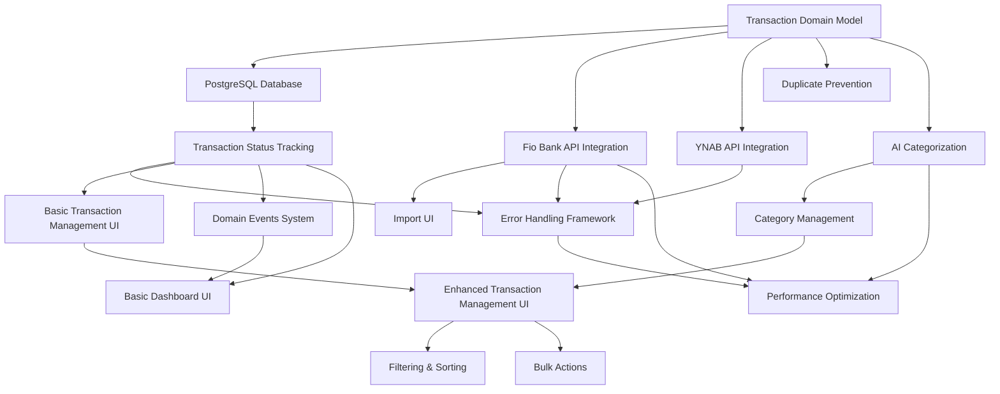

> [!info] Draft Document
> This is an updated version based on the latest feature scenarios.

# Business Value Decomposition: Fio Bank to YNAB Integration

## Feature Reference
- **Related Change Request**: [CR-2025001](../change-requests/CR-2025001.md)
- **Feature Specification**: [BUDGET-001](./BUDGET-001.md)
- **Feature Scenarios**: [BUDGET-001.feature](./BUDGET-001.feature)
- **Decomposition Session Date**: 2025-04-25
- **Participants**: Product Owner, Technical Lead, Business Analyst, Developer Representative

## Business Value Analysis

### Value Drivers
| Value Driver | Description | Impact Level (1-5) | Stakeholders |
|--------------|-------------|-------------------|--------------|
| Time Savings | Reduction in manual data entry and categorization time | 5 | Finance Team, Management |
| Data Accuracy | Improved consistency and correctness of transaction data and categorization | 5 | Finance Team, Management |
| Data Quality | Cleaner transaction data, especially payee information | 5 | Finance Team, Management |
| Timeliness | More frequent and up-to-date financial data in budgeting system | 4 | Finance Team, Management |
| Audit Trail | Traceable history of all financial data transfers and modifications | 3 | Finance Team, Compliance |
| User Experience | Simplified workflow with intuitive interface | 3 | Finance Team |
| System Resilience | Ability to handle errors, network issues, and external system failures | 4 | Finance Team, IT Support |

## Scenario Value Assessment

### Domain Scenarios
| Scenario | Value Drivers | Priority (1-5) | Core/Optional |
|----------|--------------|----------------|---------------|
| Transaction import workflow creates proper domain records | Time Savings, Audit Trail | 5 | Core |
| Transaction categorization applies rules correctly | Time Savings, Data Accuracy | 5 | Core |
| Manual category override updates transaction correctly | Data Accuracy, User Experience | 4 | Core |
| Bulk category update processes multiple transactions | Time Savings, User Experience | 4 | Core |
| Transaction submission workflow marks records as submitted | Time Savings, Audit Trail | 5 | Core |
| Duplicate transaction detection prevents reprocessing | Data Accuracy, Data Quality | 5 | Core |
| Transactions require categories before submission | Data Accuracy | 4 | Core |
| Transaction status statistics are calculated correctly | User Experience, Audit Trail | 3 | Optional |
| Transaction import and categorization meets performance requirements | Time Savings, User Experience | 4 | Optional |

### UI Scenarios
| Scenario | Value Drivers | Priority (1-5) | Core/Optional |
|----------|--------------|----------------|---------------|
| Dashboard displays transaction summary statistics | User Experience, Audit Trail | 3 | Optional |
| Dashboard statistics update dynamically | User Experience | 2 | Optional |
| User can initiate a new transaction import with date range | Time Savings, User Experience | 5 | Core |
| Transaction list provides sorting and filtering | User Experience, Time Savings | 4 | Optional |
| User can edit transaction category via dropdown | Data Accuracy, User Experience | 5 | Core |
| Bulk selection and submission of transactions | Time Savings, User Experience | 4 | Optional |
| Error messages are displayed for validation failures | Data Accuracy, User Experience | 4 | Core |
| User interface actions meet response time requirements | User Experience | 3 | Optional |

### Integration Scenarios
| Scenario | Value Drivers | Priority (1-5) | Core/Optional |
|----------|--------------|----------------|---------------|
| System connects successfully to Fio Bank API | Time Savings, Timeliness | 5 | Core |
| Fio Bank transactions are retrieved and transformed correctly | Data Quality, Data Accuracy | 5 | Core |
| AI service categorizes transactions with required accuracy | Time Savings, Data Accuracy | 5 | Core |
| System handles Fio Bank API failures gracefully | System Resilience | 4 | Core |
| System connects successfully to YNAB API | Time Savings, Timeliness | 5 | Core |
| Transactions are submitted correctly to YNAB | Data Accuracy, Timeliness | 5 | Core |
| System handles YNAB API rate limiting | System Resilience | 3 | Optional |
| Import process meets throughput requirements | Time Savings, User Experience | 3 | Optional |

### E2E Scenarios
| Scenario | Value Drivers | Priority (1-5) | Core/Optional |
|----------|--------------|----------------|---------------|
| Complete transaction import-categorize-submit workflow | Time Savings, Data Accuracy | 5 | Core |
| User modifies categories and submits transactions | Data Accuracy, User Experience | 4 | Core |
| System prevents duplicate transaction submission | Data Accuracy, Data Quality | 5 | Core |
| Complete import-categorize-submit workflow meets all performance criteria | User Experience, Time Savings | 3 | Optional |
| System handles network interruption during workflow | System Resilience | 4 | Core |

## Feature Components Analysis

| Component | Required For | Key Scenarios | Value Drivers Satisfied | Implementation Complexity (1-5) | Value/Complexity Ratio |
|-----------|-------------|---------------|--------------------------|--------------------------------|------------------------|
| Transaction Domain Model | Core Business Logic | All @domain scenarios | Time Savings, Data Accuracy, Audit Trail | 3 | 4.3 |
| Fio Bank API Integration | Data Import | System connects to Fio Bank API, Fio Bank transactions retrieved | Time Savings, Timeliness | 3 | 3.3 |
| PostgreSQL Database | Data Storage | Transaction import workflow creates records | Time Savings, Audit Trail | 2 | 2.0 |
| Transaction Status Tracking | Workflow Management | Transaction status statistics, Transaction status updates | Audit Trail, User Experience | 2 | 2.5 |
| Domain Events System | Integration | All domain events in scenarios | Audit Trail, System Resilience | 3 | 2.3 |
| Error Handling Framework | Resilience | API failures, Network interruption, Validation failures | System Resilience, User Experience | 3 | 2.7 |
| AI Categorization | Auto-Categorization | AI service categorizes transactions | Time Savings, Data Accuracy | 4 | 2.5 |
| Category Management | Data Quality | Manual category override, Bulk category update | Data Accuracy, Time Savings | 3 | 3.3 |
| YNAB API Integration | Data Export | System connects to YNAB API, Transactions submitted to YNAB | Time Savings, Timeliness | 3 | 3.0 |
| Duplicate Prevention | Data Integrity | Duplicate transaction detection | Data Accuracy, Data Quality | 2 | 5.0 |
| Basic Dashboard UI | User Visibility | Dashboard displays statistics | User Experience | 2 | 1.5 |
| Transaction Management UI | Data Management | Transaction list, Category editing | User Experience, Data Accuracy | 3 | 2.7 |
| Import UI | User Control | User initiates import with date range | Time Savings, User Experience | 2 | 4.0 |
| Filtering & Sorting | User Efficiency | Transaction list provides sorting and filtering | User Experience, Time Savings | 2 | 2.5 |
| Bulk Actions | Efficiency | Bulk selection and submission of transactions | Time Savings, User Experience | 2 | 4.0 |
| Performance Optimization | System Quality | Performance requirements scenarios | User Experience, Time Savings | 3 | 2.3 |

## Scenario Grouping and Dependencies

### Key Scenario Groups
1. **Core Transaction Processing**
   - Transaction import workflow creates proper domain records
   - Duplicate transaction detection prevents reprocessing
   - Transaction categorization applies rules correctly
   - Transaction submission workflow marks records as submitted
   - Transactions require categories before submission

2. **External Integration**
   - System connects successfully to Fio Bank API
   - Fio Bank transactions are retrieved and transformed correctly
   - System connects successfully to YNAB API
   - Transactions are submitted correctly to YNAB
   - System handles Fio Bank API failures gracefully

3. **User Interaction**
   - User can initiate a new transaction import with date range
   - User can edit transaction category via dropdown
   - Error messages are displayed for validation failures

4. **Advanced Features**
   - Bulk category update processes multiple transactions
   - Transaction list provides sorting and filtering
   - Bulk selection and submission of transactions
   - Dashboard displays transaction summary statistics

5. **System Quality**
   - Transaction import and categorization meets performance requirements
   - User interface actions meet response time requirements
   - Import process meets throughput requirements
   - System handles network interruption during workflow

### Technical Dependencies
1. Transaction Domain Model must be implemented before all other components
2. External API integrations are required for E2E workflows
3. Database schema must be defined before any data persistence
4. Error handling framework should be implemented early for resilience
5. UI components depend on corresponding domain and integration services

## Value Delivery Sequence

### Minimum Viable Solution (MVS)
The absolute minimum set of components that deliver meaningful value:

- **Components**:
  - Transaction Domain Model
  - Fio Bank API Integration
  - PostgreSQL Database
  - Transaction Status Tracking
  - YNAB API Integration
  - Duplicate Prevention
  - Basic Import UI
  - Simple Transaction Management UI
  - Error Handling Framework
- **Key Scenarios Covered**:
  - Transaction import workflow creates proper domain records
  - System connects successfully to Fio Bank API
  - Fio Bank transactions are retrieved and transformed correctly
  - User can initiate a new transaction import with date range
  - System connects successfully to YNAB API
  - Transactions are submitted correctly to YNAB
  - Duplicate transaction detection prevents reprocessing
  - System handles Fio Bank API failures gracefully
- **Value Delivered**: Functional end-to-end import and export of transactions
- **Business Benefits Realized**:
  - Elimination of manual export/import process
  - Time savings for basic data transfer
  - Prevention of duplicate transactions in YNAB
  - Basic resilience against external system failures
- **Estimated Effort**: 8 person-days

### Value Increment 1: Categorization Capabilities
First enhancement beyond MVS:

- **Additional Components**:
  - AI Categorization
  - Category Management
  - Domain Events System
  - Enhanced Transaction Management UI
- **Key Scenarios Added**:
  - Transaction categorization applies rules correctly
  - Manual category override updates transaction correctly
  - User can edit transaction category via dropdown
  - AI service categorizes transactions with required accuracy
  - Error messages are displayed for validation failures
- **Additional Value Delivered**: AI-powered categorization with manual correction capability
- **Additional Business Benefits**:
  - Significant time savings from automated categorization
  - Improved data accuracy through AI + human oversight
  - Better financial reporting through consistent categorization
  - Enhanced budget management with proper categorization
- **Estimated Effort**: 6 person-days

### Value Increment 2: Efficiency Enhancements
Second enhancement:

- **Additional Components**:
  - Filtering & Sorting
  - Bulk Actions
  - Basic Dashboard UI
  - Performance Optimization
- **Key Scenarios Added**:
  - Transaction list provides sorting and filtering
  - Bulk selection and submission of transactions
  - Bulk category update processes multiple transactions
  - Dashboard displays transaction summary statistics
  - Transaction status statistics are calculated correctly
  - Performance-related scenarios
- **Additional Value Delivered**: Enhanced productivity and visibility for larger transaction volumes
- **Additional Business Benefits**:
  - Improved efficiency when working with many transactions
  - Better visibility of transaction processing status
  - Enhanced user satisfaction through responsive UI
  - Support for larger transaction volumes
- **Estimated Effort**: 5 person-days

## Implementation Recommendation

### Recommended Delivery Approach
- **Phase 1 (MVS)**: Week 1-2
  - Implement core domain model, API integrations, and basic UI
  - Focus on resilient end-to-end transaction flow
  - Key metrics: Successful import/export rate, time saved vs manual process
  
- **Phase 2 (Categorization)**: Week 2-3
  - Implement AI categorization with manual correction capabilities
  - Add domain events for improved system integration
  - Key metrics: Categorization accuracy, manual correction rate, end-to-end processing time

- **Phase 3 (Efficiency)**: Week 3-4
  - Add productivity enhancements for working with larger datasets
  - Implement dashboard and performance optimizations
  - Key metrics: User satisfaction, time spent on transaction management, performance metrics

### Decision Points
Critical points for evaluating whether to proceed with subsequent phases:

1. **After MVS Deployment**:
   - Metrics to evaluate: Successfully imported and exported transactions, processing time, error rate
   - Threshold for proceeding: At least 90% successful transaction processing, < 5% error rate
   - Potential pivot opportunities: Simplify YNAB integration if issues arise, adjust error handling approach

2. **After Phase 2 Deployment**:
   - Metrics to evaluate: AI categorization accuracy, user correction rate, user feedback
   - Threshold for proceeding: At least 80% categorization accuracy (per NFR1)
   - Potential pivot opportunities: Implement rules-based categorization if AI underperforms

3. **During Phase 3 Development**:
   - Metrics to evaluate: System performance under load, UI responsiveness
   - Threshold for success: Import processing >= 10 transactions/second (per NFR specs), UI response <= 2 seconds

## Technical Dependencies

### Dependency Graph

### Critical Technical Foundations
Components that must be implemented first for technical reasons, regardless of business value:

- Transaction Domain Model: Foundation for all business logic
- PostgreSQL Database: Required as the central storage for all other components
- Error Handling Framework: Essential for building resilient integrations
- Transaction Status Tracking: Required for workflow management

## Risks and Mitigations

### Value Delivery Risks
- **Risk 1**: API limitations or changes in Fio Bank or YNAB
  - Impact: Could prevent basic functionality from working
  - Mitigation: Implement robust error handling and monitoring; maintain documentation of API usage; create adapters to isolate API-specific code

- **Risk 2**: AI categorization accuracy below expectations
  - Impact: Would require more manual corrections, reducing time savings
  - Mitigation: Plan for incremental improvement of AI model; prepare fallback to rules-based categorization; implement feedback loop to improve categorization over time

- **Risk 3**: Performance issues with larger transaction volumes
  - Impact: Poor user experience, missed performance requirements
  - Mitigation: Implement pagination and lazy loading; optimize database queries; set up performance testing early

- **Risk 4**: Network reliability issues affecting integration
  - Impact: Failed or incomplete transaction processing
  - Mitigation: Implement retry mechanisms with exponential backoff; develop a transaction recovery process; provide clear error messages to users

## Approval

### Business Approval
- **Product Owner**: TBD
- **Approval Date**: TBD
- **Comments**: TBD

### Technical Approval
- **Technical Lead**: TBD
- **Approval Date**: TBD
- **Comments**: TBD

## Document History

| Version | Date | Changes | Author |
|---------|------|---------|--------|
| 0.1 | 2025-04-18 | Initial draft | AI |
| 0.2 | 2025-04-25 | Updated based on scenario priorities and dependencies | AI |