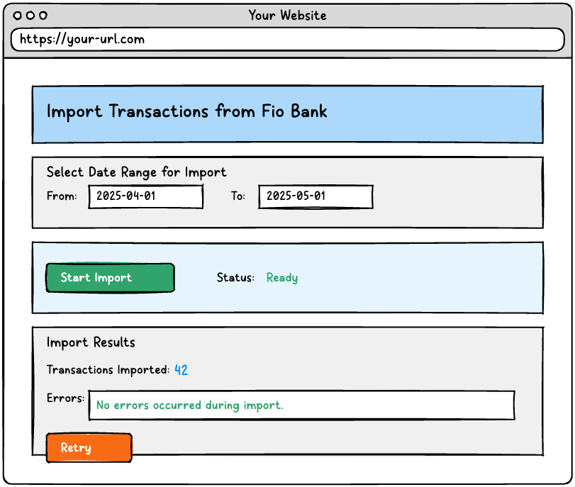

# UI Prototype Specification: VS-001 Basic Transaction Import

## Overview

This document specifies the UI components, interactions, and mock data for the Basic Transaction Import (VS-001) vertical slice. Following our UI-First approach, this specification will guide the development of the UI prototype before we implement the domain and infrastructure layers.

## User Experience Goals

- Provide a simple, intuitive interface for importing transactions from Fio Bank
- Give clear feedback on the import process status
- Handle errors gracefully and provide helpful recovery options
- Show a clear summary of import results

## UI Components

### 1. Import Page

**Purpose**: Main interface for initiating and monitoring transaction imports from Fio Bank.

**Component Hierarchy**:
```
ImportPage
├── PageHeader
├── DateRangeSelector
├── ImportActionPanel
│   ├── ImportButton
│   └── StatusIndicator
└── ResultsPanel
    ├── TransactionCountSummary
    ├── ErrorMessageDisplay
    └── RetryButton (conditional)
```

#### Layout and States



**States**:
1. Initial state - empty form
2. Valid date range selected - ready to import
3. Import in progress - loading indicator
4. Import successful - results displayed
5. Import error - error message and retry option

### 2. DateRangeSelector Component

**Purpose**: Allow users to specify the date range for transaction import.

**Properties**:
- `startDate`: LocalDate - The beginning date of the range
- `endDate`: LocalDate - The ending date of the range
- `onStartDateChange`: Function to handle start date changes
- `onEndDateChange`: Function to handle end date changes
- `validationError`: Option[String] - Error message if date range is invalid

**Validation Rules**:
- Start date must not be after end date
- Date range must not be in the future
- Date range should not exceed 90 days (Fio Bank API limitation)

**Behavior**:
- Default to current month (1st to today)
- Show calendar picker for date selection
- Display validation errors inline
- Support keyboard navigation for accessibility

**HTML Structure**:
```html
<div class="p-4 bg-white rounded-lg shadow-md" hx-target="this" hx-swap="innerHTML">
  <div class="mb-4">
    <label for="start-date" class="block text-sm font-medium text-gray-700 mb-1">Start Date</label>
    <input type="date" id="start-date" name="startDate"
           class="w-full px-3 py-2 border border-gray-300 rounded-md shadow-sm focus:outline-none focus:ring-2 focus:ring-blue-500 focus:border-blue-500"
           value="{startDate}"
           hx-post="/validate-dates"
           hx-trigger="change"
           max="{today}">
  </div>

  <div class="mb-4">
    <label for="end-date" class="block text-sm font-medium text-gray-700 mb-1">End Date</label>
    <input type="date" id="end-date" name="endDate"
           class="w-full px-3 py-2 border border-gray-300 rounded-md shadow-sm focus:outline-none focus:ring-2 focus:ring-blue-500 focus:border-blue-500"
           value="{endDate}"
           hx-post="/validate-dates"
           hx-trigger="change"
           max="{today}">
  </div>

  <div class="text-sm text-red-600 mt-2" style="display: {hasError ? 'block' : 'none'}">
    {validationError}
  </div>
</div>
```

### 3. ImportActionPanel Component

**Purpose**: Provide controls for initiating the import process and displaying its status.

**Subcomponents**:

#### 3.1 ImportButton

**Properties**:
- `isEnabled`: Boolean - Whether the button is clickable
- `isLoading`: Boolean - Whether import is in progress
- `onClick`: Function to handle click events

**States**:
- Enabled - Ready to import
- Disabled - Invalid date range or other blocking condition
- Loading - Import in progress

**HTML Structure**:
```html
<button id="import-button"
        class="w-full py-2 px-4 rounded-md font-medium text-white bg-blue-600 hover:bg-blue-700 focus:outline-none focus:ring-2 focus:ring-offset-2 focus:ring-blue-500 transition-colors
               disabled:opacity-50 disabled:cursor-not-allowed disabled:bg-blue-400
               flex items-center justify-center"
        disabled="{!isEnabled || isLoading}"
        hx-post="/import-transactions"
        hx-target="#results-panel"
        hx-indicator="#status-indicator"
        hx-disabled="{!isEnabled || isLoading}"
        hx-vals='{"startDate": "{startDate}", "endDate": "{endDate}"}'>
  {#if isLoading}
    <svg class="animate-spin -ml-1 mr-3 h-5 w-5 text-white" xmlns="http://www.w3.org/2000/svg" fill="none" viewBox="0 0 24 24">
      <circle class="opacity-25" cx="12" cy="12" r="10" stroke="currentColor" stroke-width="4"></circle>
      <path class="opacity-75" fill="currentColor" d="M4 12a8 8 0 018-8V0C5.373 0 0 5.373 0 12h4zm2 5.291A7.962 7.962 0 014 12H0c0 3.042 1.135 5.824 3 7.938l3-2.647z"></path>
    </svg>
    Importing...
  {#else}
    Import Transactions
  {/if}
</button>
```

#### 3.2 StatusIndicator

**Properties**:
- `status`: ImportStatus - Current status of import operation
- `isVisible`: Boolean - Whether the indicator is shown

**States**:
- NotStarted - Hidden
- InProgress - Animated loading indicator
- Completed - Success checkmark
- Error - Error icon

**HTML Structure**:
```html
<div id="status-indicator" class="mt-4 flex items-center" style="display: {isVisible ? 'flex' : 'none'}">
  <!-- Loading spinner -->
  <div class="animate-spin h-6 w-6 mr-3 text-blue-500" style="display: {status == ImportStatus.InProgress ? 'block' : 'none'}">
    <svg xmlns="http://www.w3.org/2000/svg" fill="none" viewBox="0 0 24 24">
      <circle class="opacity-25" cx="12" cy="12" r="10" stroke="currentColor" stroke-width="4"></circle>
      <path class="opacity-75" fill="currentColor" d="M4 12a8 8 0 018-8V0C5.373 0 0 5.373 0 12h4zm2 5.291A7.962 7.962 0 014 12H0c0 3.042 1.135 5.824 3 7.938l3-2.647z"></path>
    </svg>
  </div>
  
  <!-- Success checkmark -->
  <div class="text-green-500 h-6 w-6 mr-3" style="display: {status == ImportStatus.Completed ? 'block' : 'none'}">
    <svg xmlns="http://www.w3.org/2000/svg" fill="none" viewBox="0 0 24 24" stroke="currentColor">
      <path stroke-linecap="round" stroke-linejoin="round" stroke-width="2" d="M5 13l4 4L19 7" />
    </svg>
  </div>
  
  <!-- Error icon -->
  <div class="text-red-500 h-6 w-6 mr-3" style="display: {status == ImportStatus.Error ? 'block' : 'none'}">
    <svg xmlns="http://www.w3.org/2000/svg" fill="none" viewBox="0 0 24 24" stroke="currentColor">
      <path stroke-linecap="round" stroke-linejoin="round" stroke-width="2" d="M12 8v4m0 4h.01M21 12a9 9 0 11-18 0 9 9 0 0118 0z" />
    </svg>
  </div>
  
  <!-- Status text -->
  <div class="text-sm font-medium text-gray-700">{getStatusText()}</div>
</div>
```

### 4. ResultsPanel Component

**Purpose**: Display the results of an import operation, including success summaries or error details.

**Properties**:
- `importResults`: Option[ImportResults] - Results of the import operation
- `isVisible`: Boolean - Whether the panel is shown

**Subcomponents**:

#### 4.1 TransactionCountSummary

**Properties**:
- `transactionCount`: Int - Number of imported transactions
- `startDate`: LocalDate - Start of import date range
- `endDate`: LocalDate - End of import date range
- `isVisible`: Boolean - Whether to display this summary

**HTML Structure**:
```html
<div class="mt-6 bg-white shadow-md rounded-lg p-6" style="display: {isVisible ? 'block' : 'none'}">
  <h3 class="text-lg font-semibold text-green-700 mb-3">Import Successful</h3>
  <p class="text-gray-700 mb-2">
    Successfully imported <span class="font-bold text-gray-900">{transactionCount}</span> transactions
    from <span class="font-bold text-gray-900">{startDate}</span> to <span class="font-bold text-gray-900">{endDate}</span>.
  </p>
  <p class="text-sm text-gray-600 mb-4">
    Completed in {completionTime} seconds.
  </p>
  <a href="/transactions" class="inline-block px-4 py-2 bg-blue-600 text-white font-medium rounded-md hover:bg-blue-700 focus:outline-none focus:ring-2 focus:ring-offset-2 focus:ring-blue-500 transition-colors">
    View imported transactions
  </a>
</div>
```

#### 4.2 ErrorMessageDisplay

**Properties**:
- `errorMessage`: String - Error message to display
- `isVisible`: Boolean - Whether to display the error

**HTML Structure**:
```html
<div class="mt-6 bg-white shadow-md rounded-lg p-6 border-l-4 border-red-500" style="display: {isVisible ? 'block' : 'none'}">
  <h3 class="text-lg font-semibold text-red-700 mb-3">Import Failed</h3>
  <p class="text-red-700 mb-4">{errorMessage}</p>
  <p class="text-sm text-gray-600 mb-4">
    Please check your connection and try again. If the problem persists,
    contact support with error code: <span class="font-mono bg-gray-100 px-2 py-1 rounded text-sm">{errorCode}</span>.
  </p>
</div>
```

#### 4.3 RetryButton

**Properties**:
- `isVisible`: Boolean - Whether the button is shown
- `onClick`: Function to handle retry attempts

**HTML Structure**:
```html
<button id="retry-button"
        class="mt-4 py-2 px-4 rounded-md font-medium text-white bg-red-600 hover:bg-red-700 focus:outline-none focus:ring-2 focus:ring-offset-2 focus:ring-red-500 transition-colors flex items-center"
        style="display: {isVisible ? 'block' : 'none'}"
        hx-post="/import-transactions"
        hx-target="#results-panel"
        hx-indicator="#status-indicator"
        hx-vals='{"startDate": "{startDate}", "endDate": "{endDate}"}'>
  <svg class="h-5 w-5 mr-2" xmlns="http://www.w3.org/2000/svg" fill="none" viewBox="0 0 24 24" stroke="currentColor">
    <path stroke-linecap="round" stroke-linejoin="round" stroke-width="2" d="M4 4v5h.582m15.356 2A8.001 8.001 0 004.582 9m0 0H9m11 11v-5h-.581m0 0a8.003 8.003 0 01-15.357-2m15.357 2H15" />
  </svg>
  Try Again
</button>
```

## View Models

### ImportPageViewModel

```scala
case class ImportPageViewModel(
  startDate: LocalDate = LocalDate.now().withDayOfMonth(1),
  endDate: LocalDate = LocalDate.now(),
  importStatus: ImportStatus = ImportStatus.NotStarted,
  importResults: Option[ImportResults] = None,
  validationError: Option[String] = None
):
  def isValid: Boolean = validationError.isEmpty &&
                         startDate != null &&
                         endDate != null &&
                         !startDate.isAfter(endDate) &&
                         !startDate.isAfter(LocalDate.now())

  def isLoading: Boolean = importStatus == ImportStatus.InProgress

  def showResults: Boolean = importStatus == ImportStatus.Completed ||
                            importStatus == ImportStatus.Error
```

### ImportStatus

```scala
enum ImportStatus:
  case NotStarted, InProgress, Completed, Error
```

### ImportResults

```scala
case class ImportResults(
  transactionCount: Int,
  errorMessage: Option[String] = None,
  startTime: Instant,
  endTime: Option[Instant] = None
):
  def completionTimeSeconds: Option[Long] =
    endTime.map(end => ChronoUnit.SECONDS.between(startTime, end))

  def isSuccess: Boolean = errorMessage.isEmpty
```

## Mock Data and Services

### MockImportService

```scala
class MockImportService:
  def importTransactions(startDate: LocalDate, endDate: LocalDate): Task[ImportResults] =
    // Simulate API call delay
    for
      _ <- ZIO.sleep(Duration.fromSeconds(2))
      result <- simulateImportResult(startDate, endDate)
    yield result

  private def simulateImportResult(startDate: LocalDate, endDate: LocalDate): Task[ImportResults] =
    // For demo purposes, generate different results based on date ranges
    val now = Instant.now()

    if startDate.getYear < 2000 then
      // Simulate error for very old dates
      ZIO.succeed(ImportResults(
        transactionCount = 0,
        errorMessage = Some("Cannot import transactions from before 2000"),
        startTime = now,
        endTime = Some(now.plusSeconds(2))
      ))
    else if startDate.isEqual(endDate) && startDate.getDayOfMonth == 15 then
      // Simulate no transactions on the 15th of any month
      ZIO.succeed(ImportResults(
        transactionCount = 0,
        errorMessage = None,
        startTime = now,
        endTime = Some(now.plusSeconds(1))
      ))
    else
      // Normal case: generate random transaction count
      val daysBetween = ChronoUnit.DAYS.between(startDate, endDate) + 1
      val count = math.max(1, (daysBetween * (2 + Random.nextInt(5))).toInt)

      ZIO.succeed(ImportResults(
        transactionCount = count,
        errorMessage = None,
        startTime = now,
        endTime = Some(now.plusSeconds(1 + Random.nextInt(3)))
      ))
```

## User Interactions

### Import Flow - Happy Path

1. User navigates to the import page
2. User selects a date range (e.g., April 1-15, 2025)
3. System validates the date range and enables the Import button
4. User clicks "Import Transactions"
5. System shows loading indicator and disables the button
6. System simulates connection to Fio Bank API and retrieval of transactions
7. System displays success message with transaction count
8. User can click to view imported transactions

### Import Flow - Error Path

1. User navigates to the import page
2. User selects an invalid date range (e.g., future dates)
3. System displays validation error and disables the Import button
4. User corrects the date range
5. System validates and enables the Import button
6. User clicks "Import Transactions"
7. System shows loading indicator
8. System encounters API error (simulated)
9. System displays error message with retry option
10. User clicks "Try Again"
11. System retries the import operation

## Implementation Notes

### Scalatags Templates

The HTML mockups will be implemented using Scalatags with HTMX for interactivity and Tailwind CSS for styling:

```scala
def renderImportPage(model: ImportPageViewModel): Tag =
  div(cls := "container mx-auto px-4 py-8 max-w-2xl")(
    renderPageHeader(),
    renderDateRangeSelector(model),
    renderImportActionPanel(model),
    renderResultsPanel(model)
  )

def renderDateRangeSelector(model: ImportPageViewModel): Tag =
  // Implement using Scalatags equivalent to HTML mockup with Tailwind classes

def renderImportActionPanel(model: ImportPageViewModel): Tag =
  // Implement using Scalatags equivalent to HTML mockup with Tailwind classes

def renderResultsPanel(model: ImportPageViewModel): Tag =
  // Implement using Scalatags equivalent to HTML mockup with Tailwind classes
```

#### Tailwind Class Utilities

To make working with Tailwind classes more maintainable in Scalatags, we'll create utility functions:

```scala
object TailwindClasses:
  // Button styles
  val primaryButton = "py-2 px-4 rounded-md font-medium text-white bg-blue-600 hover:bg-blue-700 focus:outline-none focus:ring-2 focus:ring-offset-2 focus:ring-blue-500 transition-colors"
  val dangerButton = "py-2 px-4 rounded-md font-medium text-white bg-red-600 hover:bg-red-700 focus:outline-none focus:ring-2 focus:ring-offset-2 focus:ring-red-500 transition-colors"
  
  // Form styles
  val formControl = "w-full px-3 py-2 border border-gray-300 rounded-md shadow-sm focus:outline-none focus:ring-2 focus:ring-blue-500 focus:border-blue-500"
  val formLabel = "block text-sm font-medium text-gray-700 mb-1"
  
  // Card styles
  val card = "bg-white shadow-md rounded-lg p-6"
  
  // Text styles
  val heading = "text-lg font-semibold mb-3"
  val successHeading = s"$heading text-green-700"
  val errorHeading = s"$heading text-red-700"
```

### HTMX Integration

The page will use HTMX for dynamic updates without full page reloads:

- Date validation will happen on change via HTMX request
- Import action will submit via HTMX and update only the results panel
- Status updates will be pushed using HTMX SSE (Server-Sent Events) for real-time progress

### Styling

- Use TailwindCSS for component styling
- Create custom animation for the loading state
- Use a clean, professional color scheme aligned with YNAB branding
- Ensure all components are mobile-responsive

## Testing Plan

### Component Testing

- Test DateRangeSelector validation with various date combinations
- Test ImportButton state changes based on form validity
- Test proper display of all StatusIndicator states
- Test ResultsPanel for various import outcomes

### User Flow Testing

- Test complete happy path flow with mock successful import
- Test validation error cases and recovery
- Test import error scenarios and retry functionality
- Test edge cases like zero transactions found

## Next Steps

1. Implement the UI components using Scalatags and HTMX
2. Create mock data service for testing
3. Schedule user feedback session
4. Refine UI based on feedback before proceeding to domain implementation

## Document Information

- **Created**: [Current Date]
- **Author**: Team
- **Status**: Draft
- **Related Documents**:
  - [VS-001 Implementation Plan](vs001_implementation_plan.md)
  - [Vertical Slice Plan](vertical_slice_plan.md)
