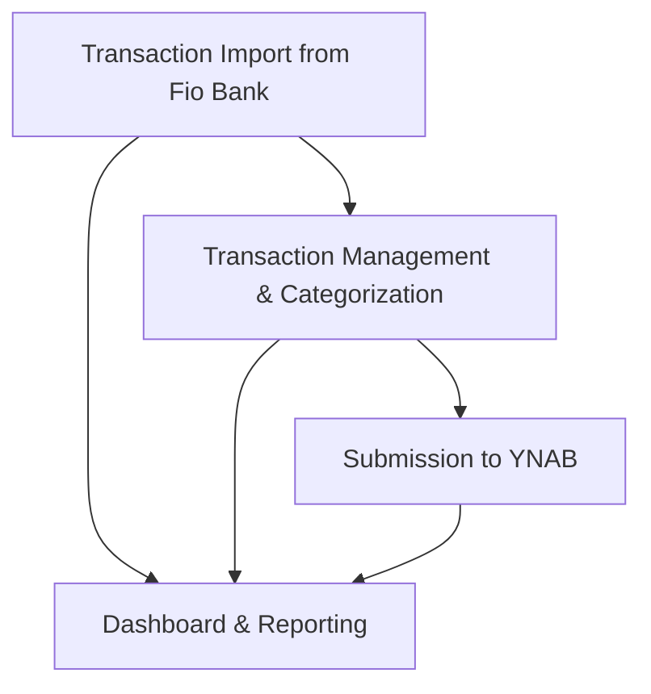

# Feature Decomposition: Fio Bank to YNAB Integration

## Feature Information

**Feature Name:** Fio Bank to YNAB Integration
**Change Request:** CR-2025001
**Product Owner:** Michal Příhoda
**Technical Lead:** Michal Příhoda

## Business Context

**Business Need:**
This feature addresses the need to automate the process of importing, categorizing, and submitting financial transactions from Fio Bank to YNAB (You Need A Budget). Currently, finance team members manually export data from Fio Bank and import it into YNAB, which is time-consuming, error-prone, and delays financial reporting.

**User Personas:**
- **Finance Team Member**: Responsible for maintaining accurate financial records in YNAB, needs to regularly import and categorize transactions from Fio Bank.
- **Administrator**: Responsible for setting up and managing the system, ensuring data security and system reliability.

**Success Metrics:**
- **Time Savings**: Reduce the time spent on transaction importing and categorization by 80%
- **Categorization Accuracy**: Achieve at least 80% accuracy in AI-suggested categories compared to human verification
- **User Satisfaction**: Achieve 4.5/5 rating from finance team members for the new process

## Feature Overview

The Fio Bank to YNAB Integration is a web-based tool that automates the import, categorization, and submission of financial transactions from Fio Bank to YNAB. The system uses AI for transaction categorization and provides a user interface for review and modification before submission, ensuring data accuracy while significantly reducing manual effort.

## Vertical Slice Identification

### Slice 1: Transaction Import from Fio Bank

**Description:**
Enable users to import transactions from Fio Bank for a specified date range.

**User Value:**
Finance team members can automatically retrieve transaction data from Fio Bank without manually exporting files, saving time and reducing data handling errors.

**UI Entry Points:**
- Dashboard with Import button
- Date range selection dialog
- Import progress and status indicators

**Technical Scope:**
- **UI Layer:** Import form with date range selector, progress indicators
- **Domain Layer:** Transaction entity, Import service
- **Infrastructure Layer:** Fio Bank API client, Transaction repository, PostgreSQL storage

**Definition of Done:**
- Users can specify a date range for transaction import
- Transactions are retrieved from Fio Bank API
- Transactions are stored in the local database
- Import status and results are displayed to the user

### Slice 2: Transaction Management & Categorization

**Description:**
Display imported transactions with their status and implement AI-based categorization with the ability to manually modify categories.

**User Value:**
Finance team members can view all imported transactions, benefit from automatic categorization suggestions, and make manual adjustments where needed.

**UI Entry Points:**
- Transaction list view with status indicators and filters
- Transaction detail panel with category editing
- Bulk action controls for multiple transactions

**Technical Scope:**
- **UI Layer:** Transaction table, category selection controls, filters and search, bulk actions
- **Domain Layer:** Category entity, Categorization service, Transaction filtering
- **Infrastructure Layer:** OpenAI API integration, Category repository

**Definition of Done:**
- Transactions display with relevant details (date, amount, description)
- AI automatically suggests categories for transactions
- Users can manually edit categories for individual transactions
- Users can filter, search, and sort transactions
- Bulk categorization actions are available

### Slice 3: Submission to YNAB

**Description:**
Enable the selection and submission of categorized transactions to YNAB with duplicate detection.

**User Value:**
Finance team members can submit properly categorized transactions to YNAB with confidence that duplicates will be prevented, completing the automated workflow.

**UI Entry Points:**
- Transaction selection controls
- Submit to YNAB button
- Submission confirmation and results view

**Technical Scope:**
- **UI Layer:** Transaction selection UI, submission controls, results display
- **Domain Layer:** Submission service, Duplicate detection logic
- **Infrastructure Layer:** YNAB API client, Submission tracking repository

**Definition of Done:**
- Users can select transactions for submission
- System connects to YNAB API and submits transactions
- Duplicate transactions are detected and prevented
- Submission results are clearly displayed
- Transaction status is updated to reflect submission

### Slice 4: Dashboard & Reporting

**Description:**
Provide an overview dashboard with key metrics and reporting on transaction processing.

**User Value:**
Finance team members and administrators can get a high-level view of system activity, track performance metrics, and identify any issues requiring attention.

**UI Entry Points:**
- Dashboard home screen
- Summary statistics cards
- Activity timeline

**Technical Scope:**
- **UI Layer:** Dashboard components, statistics displays, charts and graphs
- **Domain Layer:** Reporting service, Statistics calculations
- **Infrastructure Layer:** Reporting repository, Caching mechanisms

**Definition of Done:**
- Dashboard displays key metrics (transactions imported, categorized, submitted)
- Activity timeline shows recent system activities
- Statistics on categorization accuracy are available
- Performance metrics are tracked and displayed

## Business Value Analysis

| Slice | Business Value | Implementation Complexity | User Impact | Priority |
|-------|---------------|---------------------------|------------|----------|
| Transaction Import from Fio Bank | High | Medium | High | 1 |
| Transaction Management & Categorization | High | High | High | 2 |
| Submission to YNAB | High | Medium | High | 3 |
| Dashboard & Reporting | Medium | Low | Medium | 4 |

## Implementation Sequence Rationale

The implementation sequence follows the natural flow of data through the system and prioritizes the core functionality:

1. **Transaction Import** is the foundational slice that enables data to enter the system.
2. **Transaction Management & Categorization** builds on the import functionality to add value through AI categorization.
3. **Submission to YNAB** completes the core workflow by sending the processed data to its final destination.
4. **Dashboard & Reporting** enhances the user experience but is not essential for the core workflow.

This sequence ensures that each slice builds on the previous one, and users can realize value from the earlier slices even before the entire feature is complete.

## Dependencies and Relationships

## Risk Assessment

| Slice | Risks | Mitigation Strategy |
|-------|-------|---------------------|
| Transaction Import from Fio Bank | - Fio Bank API changes - Authentication issues - Rate limiting | - Implement API version checking - Robust error handling - Implement retry mechanism with backoff |
| Transaction Management & Categorization | - AI categorization accuracy below target - Performance issues with large transaction volumes | - Implement feedback loop for improving AI - Add user-defined rules for common transactions - Implement pagination and lazy loading |
| Submission to YNAB | - YNAB API changes - Failed submissions - Duplicate detection failures | - Implement API version checking - Transaction-based retry mechanism - Robust duplicate detection algorithm with multiple criteria |
| Dashboard & Reporting | - Performance impact of complex queries - Data accuracy in reports | - Implement caching strategy - Separate reporting database - Automated tests for report accuracy |

## Technical Considerations

**Architecture Implications:**
- The system follows the Functional Core/Imperative Shell pattern with ZIO for effect management
- Domain logic is implemented as pure functions with effects at the boundaries
- The UI uses Scalatags for HTML generation with HTMX for interactivity
- Background processing is required for longer-running tasks like imports and AI categorization

**Cross-Cutting Concerns:**
- **Security**: API key based authentication with Fio Bank, secure token storage, HTTPS for all communications, encryption of sensitive data in database
- **Performance**: Pagination for transaction lists, background processing for imports, caching for frequently accessed data
- **Accessibility**: WCAG 2.1 AA compliance for all UI components, keyboard navigation support
- **Internationalization**: Support for English and Czech languages, proper handling of currency formats

## Approvals

- **Product Owner:** Michal Příhoda
- **Technical Lead:** Michal Příhoda
- **UX Designer:** Michal Příhoda
- **Key Stakeholder:** Michal Příhoda
