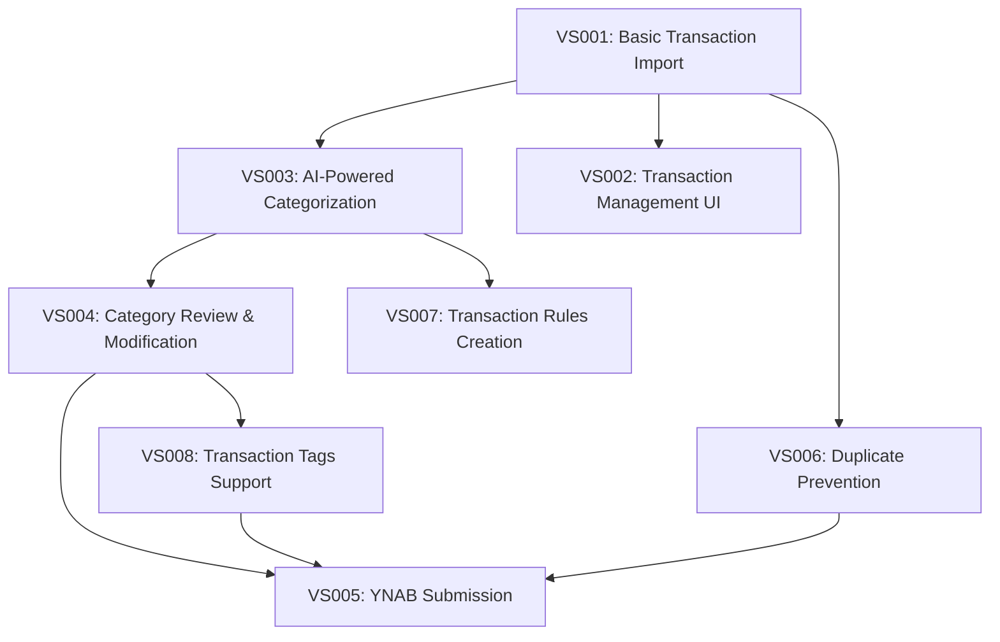

# Feature: Fio Bank to YNAB Integration (BUDGET-001)

## Slice Breakdown

| Slice # | Name | Key Scenarios | Business Value | Status | Next Step | Owner |
|---------|------|---------------|----------------|--------|-----------|-------|
| VS001 | Basic Transaction Import | - Import transactions from Fio Bank - Handle import with no transactions - Handle import errors | Time Savings (5) | In Progress | Begin UI prototype development for DateRangeSelector component | Team |
| VS003 | AI-Powered Categorization | - Auto-categorize transactions - Handle ambiguous descriptions - Batch categorization performance | Data Accuracy (4) | Not Started | - | - |
| VS004 | Category Review & Modification | - Change transaction category - Batch modify categories - Filter by confidence score | Data Accuracy (4) | Not Started | - | - |
| VS005 | YNAB Submission | - Submit transactions to YNAB - Handle API errors - Map to YNAB format | Reporting Speed (3) | Not Started | - | - |
| VS002 | Transaction Management UI | - View transaction list - Filter and sort transactions - Search transactions | Time Savings (5) | Not Started | - | - |
| VS006 | Duplicate Prevention | - Detect duplicates - Prevent duplicate submission - Handle conflicts | Data Accuracy (4) | Not Started | - | - |
| VS007 | Transaction Rules Creation | - Create categorization rules - Apply rules to transactions - Manage rule priority | Time Savings (5) | Not Started | - | - |
| VS008 | Transaction Tags Support | - Add tags to transactions - Submit tags to YNAB - Filter by tags | Organization (3) | Not Started | - | - |

## Implementation Sequence

### Phase 1: Core Functionality
1. VS001: Basic Transaction Import (In Progress)
2. VS003: AI-Powered Categorization
3. VS004: Category Review & Modification
4. VS005: YNAB Submission

### Phase 2: Enhanced Functionality
5. VS002: Transaction Management UI
6. VS006: Duplicate Prevention

### Phase 3: Optional Enhancements
7. VS007: Transaction Rules Creation
8. VS008: Transaction Tags Support

## Business Value Drivers

| Value Driver | Description | Impact Level (1-5) |
|--------------|-------------|-------------------|
| Time Savings | Reduce manual data entry time | 5 |
| Data Accuracy | Improve categorization accuracy | 4 |
| Reporting Speed | Enable faster financial reporting | 3 |
| Organization | Improve financial data organization | 3 |

## Technical Dependencies

## Document Information
- **Created**: 2025-05-02
- **Author**: Team
- **Status**: In Progress
- **Related Documents**:
  - [Feature Specification](feature.md)
  - [Vertical Slice Plan](vertical_slice_plan.md)