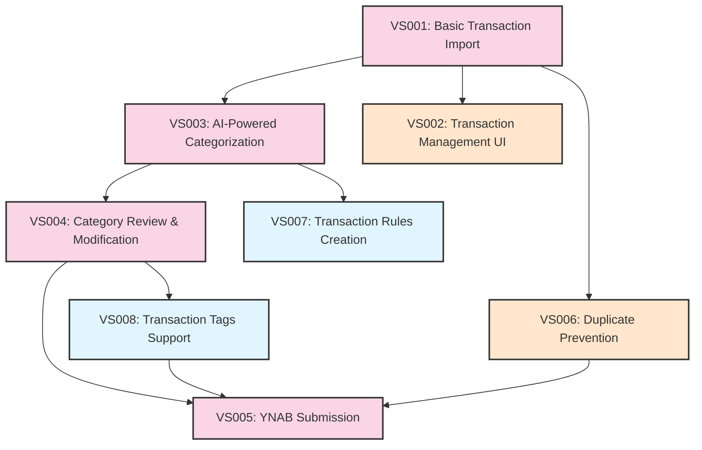

# Vertical Slice Plan: Fio Bank to YNAB Integration

## Overview

This document outlines the implementation plan for the vertical slices of the Fio Bank to YNAB Integration feature (BUDGET-001). Following our UI-First BDD Development workflow, we will implement each slice with a focus on user experience first, followed by domain implementation and infrastructure.

## Implementation Sequence

Based on the business value assessment, we will implement the vertical slices in the following sequence:

### Phase 1: Core Functionality

1. **VS001: Basic Transaction Import**
2. **VS003: AI-Powered Categorization**
3. **VS004: Category Review & Modification**
4. **VS005: YNAB Submission**

### Phase 2: Enhanced Functionality

5. **VS002: Transaction Management UI**
6. **VS006: Duplicate Prevention**

### Phase 3: Optional Enhancements

7. **VS007: Transaction Rules Creation**
8. **VS008: Transaction Tags Support**

## Detailed Slice Plans

### VS001: Basic Transaction Import

**Description**: This slice enables the system to connect to Fio Bank API, retrieve transactions for a specified date range, and store them in the local database.

**Key Scenarios**:
```gherkin
Feature: Fio Bank Transaction Import

Scenario: Successful import of transactions from Fio Bank
  Given I am on the import page
  When I specify a date range from "2025-04-01" to "2025-04-15"
  And I click the "Import Transactions" button
  Then the system should connect to Fio Bank API
  And retrieve all transactions for the specified date range
  And store them in the database
  And display a success message with the count of imported transactions

Scenario: Import with no new transactions
  Given I am on the import page
  When I specify a date range with no new transactions
  And I click the "Import Transactions" button
  Then the system should connect to Fio Bank API
  And determine there are no new transactions
  And display an appropriate message indicating no new transactions

Scenario: Error during import from Fio Bank
  Given I am on the import page
  When I specify a date range from "2025-04-01" to "2025-04-15"
  And I click the "Import Transactions" button
  And the Fio Bank API is unavailable
  Then the system should display an error message
  And provide retry options
```

**UI Components**:
- Date range selector
- Import button
- Status/progress indicator
- Results summary panel
- Error message component

**Domain Concepts**:
- Transaction (Entity)
- ImportBatch (Entity)
- FioBankService (Service)
- TransactionRepository (Repository Interface)

**Infrastructure Requirements**:
- Fio Bank API Client
- PostgreSQL Database with Transaction and ImportBatch tables
- Error handling and retry mechanism

**Dependencies**:
- Fio Bank API credentials
- Database schema for transactions

**Estimated Effort**: 5 person-days

**Technical Risks**:
- Fio Bank API changes or downtime
- Rate limiting on Fio Bank API
- Complex transaction data mapping

**Mitigation Strategies**:
- Implement robust error handling and retry logic
- Cache transaction data during import process
- Create comprehensive test suite with mocked API responses

### VS003: AI-Powered Categorization

**Description**: This slice enables automatic categorization of imported transactions using AI (OpenAI API) to analyze transaction descriptions and assign appropriate YNAB categories.

**Key Scenarios**:
```gherkin
Feature: AI Transaction Categorization

Scenario: Automatic categorization of new transactions
  Given there are uncategorized transactions in the database
  When the system runs the automatic categorization process
  Then each transaction should be analyzed by the AI service
  And assigned an appropriate YNAB category
  And updated in the database with the assigned category
  And a confidence score for the categorization

Scenario: Handling transactions with ambiguous descriptions
  Given there is a transaction with an ambiguous description
  When the system attempts to categorize it
  Then the AI should assign the most probable category
  And mark it with a lower confidence score
  And flag it for human review

Scenario: Batch categorization performance
  Given there are 100 uncategorized transactions
  When the automatic categorization process runs
  Then all transactions should be categorized within 60 seconds
  And the system should not exceed rate limits of the AI service
```

**UI Components**:
- Categorization status indicator
- Batch categorization trigger button
- Confidence score visualization
- Category review queue

**Domain Concepts**:
- Category (Entity)
- CategorizationService (Service)
- AIProviderService (Service Interface)
- CategoryRepository (Repository Interface)

**Infrastructure Requirements**:
- OpenAI API Integration
- Category mapping between AI outputs and YNAB categories
- Confidence score calculation logic
- Rate limiting and batching mechanism

**Dependencies**:
- VS001 (Basic Transaction Import)
- OpenAI API credentials
- YNAB category list

**Estimated Effort**: O7 person-days

**Technical Risks**:
- OpenAI API changes or downtime
- Poor categorization accuracy for specific transaction types
- OpenAI rate limits and costs

**Mitigation Strategies**:
- Implement caching for similar transactions
- Create fallback categorization rules
- Batch processing to optimize API usage

### VS004: Category Review & Modification

**Description**: This slice enables users to review AI-assigned categories and manually modify them if necessary before submission to YNAB.

**Key Scenarios**:
```gherkin
Feature: Transaction Category Review and Modification

Scenario: User manually changes a transaction category
  Given I am viewing the transaction list
  When I select a transaction with description "Coffee Shop"
  And I see it is categorized as "Dining Out"
  And I change the category to "Coffee Shops"
  And I click "Save"
  Then the transaction should be updated with the new category
  And the system should store this modification for future reference

Scenario: Batch category modification
  Given I am viewing the transaction list
  When I select multiple transactions from the same merchant
  And I choose to change all their categories to "Groceries"
  And I click "Apply to Selected"
  Then all selected transactions should be updated with the "Groceries" category
  And a confirmation message should be displayed

Scenario: Filter transactions by confidence score
  Given I am viewing the transaction list
  When I select the filter "Low Confidence Categorization"
  Then the list should display only transactions with low confidence scores
  And I should be able to easily review and correct these categories
```

**UI Components**:
- Transaction category editor
- Category selector dropdown
- Batch selection tools
- Confidence score filter
- Transaction details panel

**Domain Concepts**:
- UserCategorization (Entity)
- CategoryMapping (Value Object)
- TransactionService (Service)
- UserPreferenceRepository (Repository Interface)

**Infrastructure Requirements**:
- UI state management for editing multiple transactions
- Optimistic updates for better UX
- History of user category changes

**Dependencies**:
- VS001 (Basic Transaction Import)
- VS003 (AI-Powered Categorization)
- Complete list of YNAB categories

**Estimated Effort**: 6 person-days

**Technical Risks**:
- Complex UI state management
- Performance with large transaction sets
- Category hierarchy representation

**Mitigation Strategies**:
- Implement pagination for large transaction sets
- Use optimistic UI updates
- Create comprehensive UI tests

### VS005: YNAB Submission

**Description**: This slice enables the system to submit categorized transactions to YNAB via the YNAB API, ensuring they appear in the correct account and budget.

**Key Scenarios**:
```gherkin
Feature: Transaction Submission to YNAB

Scenario: Successful submission of transactions to YNAB
  Given I have reviewed and categorized transactions
  When I select transactions and click "Submit to YNAB"
  Then the system should connect to YNAB API
  And submit the selected transactions with their categories
  And update their status to "Submitted"
  And display a confirmation with the submission results

Scenario: Handling YNAB API errors during submission
  Given I have selected transactions for submission
  When I click "Submit to YNAB"
  And the YNAB API returns an error
  Then the system should display an appropriate error message
  And keep the transactions marked as "Ready for Submission"
  And provide retry options

Scenario: Mapping transaction data to YNAB format
  Given I have transactions with Fio Bank specific data
  When these transactions are submitted to YNAB
  Then the system should correctly map all fields to YNAB format
  And include appropriate transaction identifiers for future reference
```

**UI Components**:
- Transaction submission control
- Submission status indicator
- Batch selection for submission
- Confirmation dialog
- Results summary view

**Domain Concepts**:
- YNABSubmission (Entity)
- SubmissionService (Service)
- YNABService (Service Interface)
- SubmissionRepository (Repository Interface)

**Infrastructure Requirements**:
- YNAB API Integration
- Transaction mapping logic
- Submission tracking and status management
- Error handling and retry logic

**Dependencies**:
- VS001 (Basic Transaction Import)
- VS004 (Category Review & Modification)
- YNAB API credentials
- YNAB budget and account IDs

**Estimated Effort**: 6 person-days

**Technical Risks**:
- YNAB API changes or downtime
- Complex mapping requirements
- Transaction reconciliation issues

**Mitigation Strategies**:
- Create comprehensive YNAB API integration tests
- Implement detailed logging for troubleshooting
- Build transaction reconciliation tools

## Technical Dependencies Between Slices



## UI Wireframes

Initial wireframes for the first vertical slice (VS001: Basic Transaction Import) will be created as part of the UI prototype specification document.

## Domain Model Evolution

The domain model will evolve with each vertical slice:

1. **VS001**: Establish core Transaction and ImportBatch entities
2. **VS003**: Add Category entity and categorization logic
3. **VS004**: Extend with user-specific categorization preferences
4. **VS005**: Add submission tracking and YNAB integration concepts
5. **VS006**: Incorporate duplicate detection mechanisms
6. **VS007**: Add rule-based categorization concepts
8. **VS008**: Extend with tag support

## User Feedback Touchpoints

To ensure we're building the right solution, we'll gather user feedback at these key points:

1. After VS001: Validate the import process and transaction display
2. After VS003: Evaluate AI categorization accuracy
3. After VS004: Test the category review and modification experience
4. After VS005: Verify end-to-end workflow with YNAB submission

## Next Steps

1. Create UI prototype specification for VS001 (Basic Transaction Import)
2. Develop Gherkin scenarios for VS001 in detail
3. Implement UI prototype for VS001 following the UI-First approach
4. Schedule user feedback session for VS001 validation

## Document Information

- **Created**: [Current Date]
- **Author**: Team
- **Status**: Draft
- **Related Documents**:
  - [Feature Specification](feature.md)
  - [Business Value Assessment](business_value_assessment.md)
