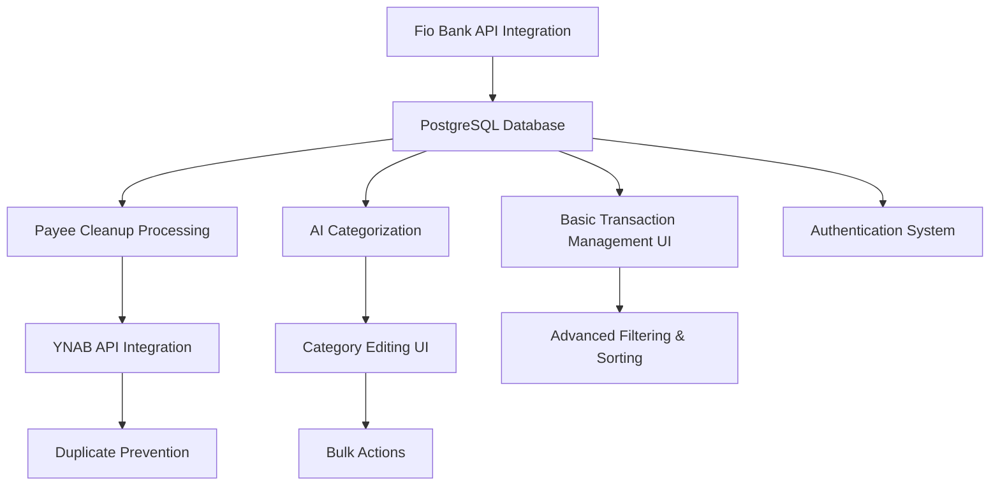

> [!info] Draft Document
> This document is an initial draft and may change significantly.

# Business Value Decomposition: Fio Bank to YNAB Integration

## Feature Reference
- **Related Change Request**: [CR-2025001](../change-requests/CR-2025001.md)
- **Feature Specification**: [FIOYNAB-001](./FIOYNAB-001.md)
- **Decomposition Session Date**: 2025-04-18
- **Participants**: Product Owner, Technical Lead, Business Analyst, Developer Representative

## Business Value Analysis

### Value Drivers
| Value Driver | Description | Impact Level (1-5) | Stakeholders |
|--------------|-------------|-------------------|--------------|
| Time Savings | Reduction in manual data entry and categorization time | 5 | Finance Team, Management |
| Data Accuracy | Improved consistency and correctness of transaction data and categorization | 5 | Finance Team, Management |
| Data Quality | Cleaner transaction data, especially payee information | 5 | Finance Team, Management |
| Timeliness | More frequent and up-to-date financial data in budgeting system | 4 | Finance Team, Management |
| Audit Trail | Traceable history of all financial data transfers and modifications | 3 | Finance Team, Compliance |
| User Experience | Simplified workflow with intuitive interface | 3 | Finance Team |

### Feature Components Analysis
| Component | Required For | Value Drivers Satisfied | Implementation Complexity (1-5) | Value/Complexity Ratio |
|-----------|-------------|--------------------------|--------------------------------|------------------------|
| Fio Bank API Integration | Data Import | Time Savings, Timeliness | 3 | 3.0 |
| PostgreSQL Database | Data Storage | Time Savings, Audit Trail | 2 | 2.0 |
| Basic Transaction Management UI | Data Visibility | User Experience | 2 | 1.5 |
| Payee Cleanup Processing | Data Quality | Data Accuracy, Time Savings | 2 | 4.0 |
| AI Categorization | Auto-Categorization | Time Savings, Data Accuracy | 4 | 2.25 |
| Category Editing UI | Manual Corrections | Data Accuracy, User Experience | 2 | 3.5 |
| YNAB API Integration | Data Export | Time Savings, Timeliness | 3 | 3.0 |
| Duplicate Prevention | Data Integrity | Data Accuracy, Audit Trail | 2 | 3.5 |
| Authentication System | Security | Audit Trail | 2 | 1.5 |
| Advanced Filtering & Sorting | User Convenience | User Experience | 2 | 1.5 |
| Bulk Actions | Efficiency | Time Savings, User Experience | 2 | 4.0 |

## Value Delivery Sequence

### Minimum Viable Solution (MVS)
The absolute minimum set of components that deliver meaningful value:

- **Components**:
  - Fio Bank API Integration
  - PostgreSQL Database
  - Basic Transaction Management UI
  - Payee Cleanup Processing
  - YNAB API Integration
  - Duplicate Prevention
- **Value Delivered**: Automated import and export of transactions with payee cleanup
- **Business Benefits Realized**:
  - Elimination of manual export/import process
  - Time savings for basic data transfer
  - Improved data quality through payee cleanup
  - Prevention of duplicate transactions in YNAB
- **Estimated Effort**: 7 person-days

### Value Increment 1
First enhancement beyond MVS:

- **Additional Components**:
  - AI Categorization
  - Category Editing UI
- **Additional Value Delivered**: Automated transaction categorization with manual correction capability
- **Additional Business Benefits**:
  - Significant time savings from automated categorization
  - Improved data accuracy through AI + human oversight
  - Better financial reporting through consistent categorization
  - Enhanced budget management with proper categorization
- **Estimated Effort**: 5 person-days

### Value Increment 2
Second enhancement:

- **Additional Components**:
  - Authentication System
  - Advanced Filtering & Sorting
  - Bulk Actions
- **Additional Value Delivered**: Secure, efficient transaction management for larger datasets
- **Additional Business Benefits**:
  - Improved security for financial data
  - Enhanced efficiency when working with many transactions
  - Better user experience for finance team
- **Estimated Effort**: 4 person-days

## Implementation Recommendation

### Recommended Delivery Approach
- **Phase 1 (MVS)**: Week 1-2
  - Fio Bank API Integration, PostgreSQL Database, Basic Transaction Management UI, Payee Cleanup Processing, YNAB API Integration, Duplicate Prevention
  - Key metrics to monitor: Manual time saved, successful import/export rate, payee data quality improvement

- **Phase 2**: Week 2-3
  - AI Categorization, Category Editing UI
  - Key metrics to monitor: Categorization accuracy, manual correction rate

- **Phase 3**: Week 3-4
  - Authentication System, Advanced Filtering & Sorting, Bulk Actions
  - Key metrics to monitor: User satisfaction, time spent on transaction management

### Decision Points
Critical points for evaluating whether to proceed with subsequent phases:

1. **After MVS Deployment**:
   - Metrics to evaluate: Successfully imported and exported transactions, time savings
   - Threshold for proceeding: At least 90% successful transaction processing
   - Potential pivot opportunities: Simplify YNAB integration if issues arise

2. **After Phase 2 Deployment**:
   - Metrics to evaluate: AI categorization accuracy, user correction rate
   - Threshold for proceeding: At least 75% categorization accuracy
   - Potential pivot opportunities: Implement rules-based categorization if AI underperforms

## Technical Dependencies

### Dependency Graph

### Critical Technical Foundations
Components that must be implemented first for technical reasons, regardless of business value:

- PostgreSQL Database: Required as the central storage for all other components
- Basic Transaction Management UI: Required for any user interaction with the system

## Risks and Mitigations

### Value Delivery Risks
- **Risk 1**: API limitations or changes in Fio Bank or YNAB
  - Impact: Could prevent basic functionality from working
  - Mitigation: Implement robust error handling and monitoring; maintain documentation of API usage

- **Risk 2**: AI categorization accuracy below expectations
  - Impact: Would require more manual corrections, reducing time savings
  - Mitigation: Plan for incremental improvement of AI model; prepare fallback to rules-based categorization

- **Risk 3**: User adoption resistance
  - Impact: Reduced usage and value realization
  - Mitigation: Early user involvement in UI design; comprehensive training; focus on intuitive interface

## Approval

### Business Approval
- **Product Owner**: TBD
- **Approval Date**: TBD
- **Comments**: TBD

### Technical Approval
- **Technical Lead**: TBD
- **Approval Date**: TBD
- **Comments**: TBD

## Document History

| Version | Date | Changes | Author |
|---------|------|---------|--------|
| 0.1 | 2025-04-18 | Initial draft | AI |
