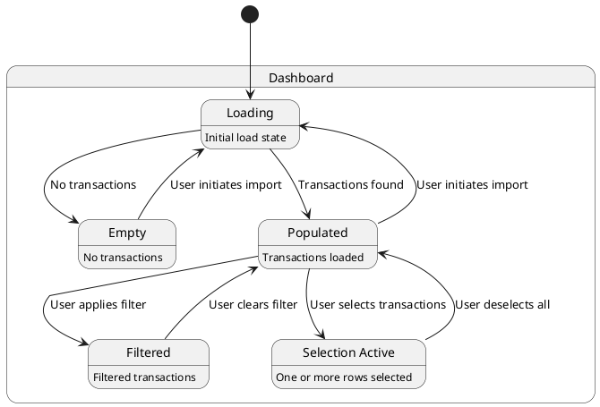
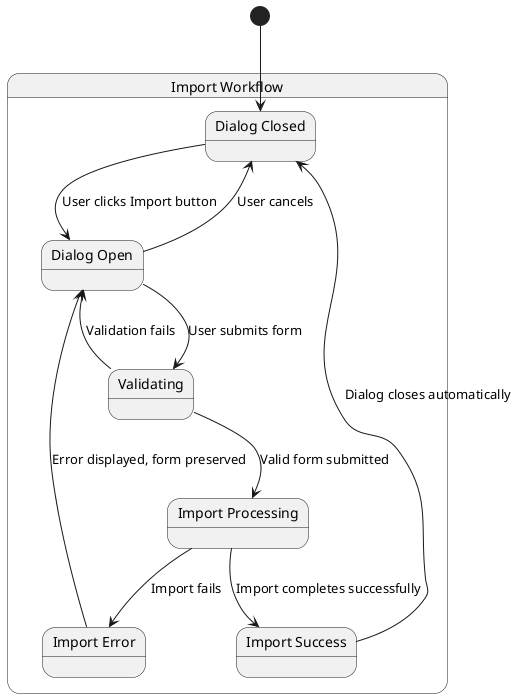
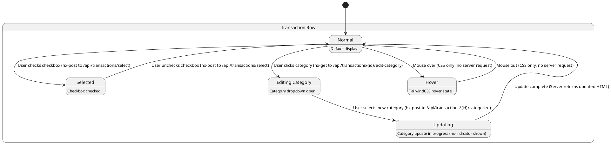
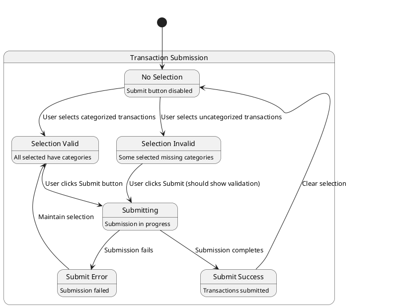
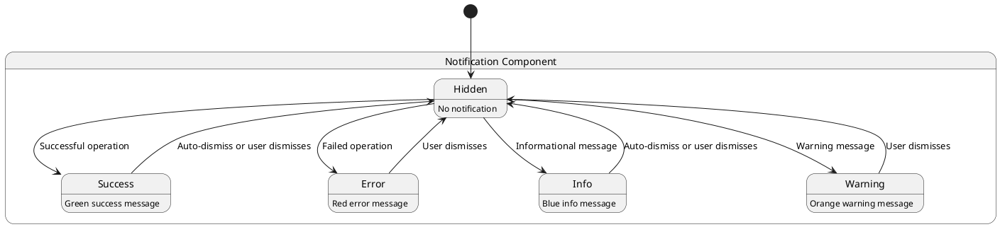
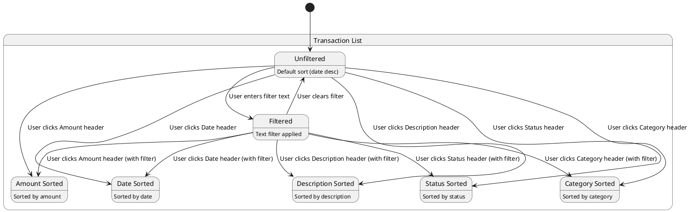
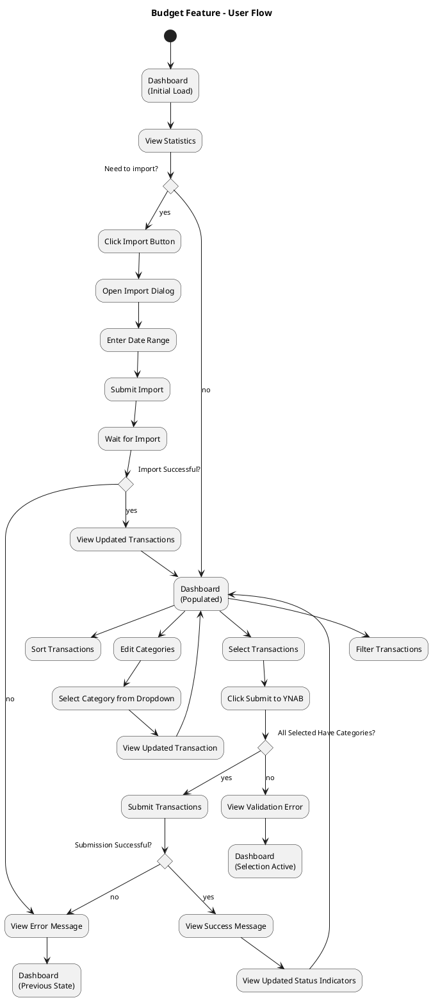
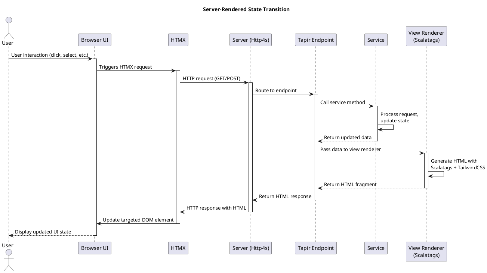

# UI State Diagrams

This document outlines the state transitions and interactive behaviors of key UI components in the Budget feature. All state management happens on the server-side following our server-rendered Scalatags + HTMX architecture, with TailwindCSS providing the styling.

## HTMX-Driven State Management

All state transitions in our application are implemented through HTMX attributes that trigger server requests. When a state change occurs:

1. HTMX sends a request to the server with the relevant data
2. The server processes the request and determines the new state
3. The server renders a new HTML fragment using Scalatags with TailwindCSS classes
4. HTMX replaces the targeted DOM element with the new HTML

This ensures all UI state is managed by the server, making our application more robust and easier to reason about.

## Dashboard States

## Import Dialog States

## Transaction Row States

Note: In our server-rendered architecture, most state changes involve:
1. HTMX sends request to the server
2. Server processes the request
3. Server renders a new HTML fragment with Scalatags + TailwindCSS
4. HTMX updates the DOM with the new HTML

Pure CSS states like hover are handled client-side through TailwindCSS hover: classes without server requests.

## Transaction Submission States

## Notification States

## Transaction Filter and Sort States

## Combined User Flow

## Server-Rendered Architecture Implementation

Our UI state diagrams represent logical state transitions, but the technical implementation leverages our server-rendered Scalatags + HTMX + TailwindCSS architecture.

### Technical Implementation

### Key Aspects of Our Architecture

1. **Server-Side State**: All application state is maintained on the server
2. **HTML Over the Wire**: State changes are communicated as HTML fragments, not JSON
3. **Targeted Updates**: HTMX only updates the specific DOM elements that need to change
4. **Progressive Enhancement**: The application works without JavaScript, but is enhanced with HTMX
5. **TailwindCSS Styling**: Visual presentation is handled by TailwindCSS utility classes
6. **Type-Safe Templates**: Scalatags provides type-safe HTML generation on the server

This architecture provides several benefits:
- Simpler client-side code with less JavaScript
- Consistent state management on the server
- More robust progressive enhancement
- Improved performance through smaller, targeted updates
- Type safety through Scala's type system